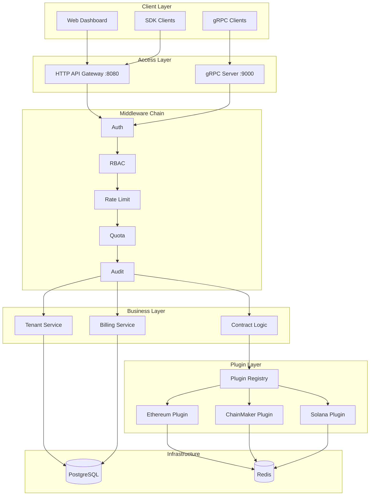

**English** | **[中文](README_CN.md)** | **[📖 Usage Guide](doc/USAGE.md)** | **[🏗️ Architecture](doc/architecture_en.md)**

# Chain Interactive Service

A universal blockchain interaction service platform (BaaS - Blockchain as a Service) that provides unified gRPC and RESTful HTTP interfaces to interact with multiple blockchains (Ethereum, ChainMaker, Solana), abstracting away the underlying chain differences so that upper-layer services don't need to care about chain-specific implementation details.

## ✨ Features

### Core Capabilities
- 🔗 **Multi-Chain Support**: Unified interface for Ethereum, ChainMaker, and Solana, with plugin architecture for easy expansion
- 📝 **Contract Invocation**: Supports both Invoke (write) and Query (read) call modes
- 🔍 **Transaction Query**: Query transaction details and on-chain status by transaction ID
- 📡 **Event Subscription**: Subscribe to contract events with automatic resubscription on failure
- ⚡ **Sync/Async**: Contract calls support both synchronous waiting and asynchronous return

### Commercial Features (BaaS Platform)
- 👥 **Multi-Tenancy**: Complete tenant isolation with independent chain configs, API Keys, and quotas
- 🔑 **Authentication & Authorization**: API Key authentication + RBAC role-based access control
- 💰 **Billing & Quotas**: Usage metering, quota management, bill generation, overage policies
- 🌐 **HTTP API Gateway**: RESTful API with rate limiting, making integration easy without gRPC knowledge
- 🛡️ **Security**: IP whitelist, audit logging, anomaly detection with auto-banning, sensitive data masking
- 🔌 **Plugin Architecture**: Standardized chain plugin interface for rapid integration of new chains
- 📊 **Admin Dashboard API**: Usage statistics, call logs, billing, audit log queries

### Infrastructure
- 🔒 **gRPC Security**: Supports TLS mutual authentication
- 📊 **Monitoring & Tracing**: Prometheus metrics + OpenTelemetry distributed tracing
- ☸️ **Kubernetes Ready**: Helm Chart with HPA auto-scaling, PDB, leader election
- 🔄 **High Availability**: Stateless horizontal scaling, distributed leader election for subscriptions

## Supported Chains

| Chain | Type | Contract Call | Transaction Query | Event Subscription |
|---|---|---|---|---|
| **Ethereum** | Public | ✅ | ✅ | ✅ |
| **ChainMaker** | Consortium | ✅ | ✅ | ✅ |
| **Solana** | Public | ✅ | ✅ | ✅ |

> 🚧 More chains can be added via the plugin architecture (Polygon, BSC, Avalanche, Aptos, Sui, Fabric, etc.)

## Architecture



> 📖 For detailed architecture diagrams and explanations, see **[Architecture Document](doc/architecture_en.md)**

## Project Structure

```
.
├── chaininteractive.go           # Service entry point
├── internal/
│   ├── config/                   # Configuration definitions & validation
│   ├── logic/                    # gRPC business logic
│   ├── sdk/                      # Chain SDK clients & tenant SDK manager
│   ├── store/                    # Data models, DB connection, repository
│   ├── gateway/                  # HTTP API Gateway (routes, handlers)
│   ├── middleware/               # Auth, RBAC, rate limit, quota, audit, anomaly
│   ├── billing/                  # Billing & quota service
│   ├── tenant/                   # Tenant management service
│   ├── plugin/                   # Plugin registry & built-in adapters
│   ├── deploy/                   # Leader election for HA
│   ├── server/                   # gRPC server registration
│   └── svc/                      # Service context (DI container)
├── proto/                        # Protobuf service definitions
├── pb/                           # Generated Protobuf Go code
├── deploy/helm/                  # Kubernetes Helm Chart
├── docker/                       # Docker build files
├── etc/                          # Configuration files
├── scripts/                      # Utility scripts
└── doc/                          # Documentation
    ├── architecture_en.md        # Architecture document (English)
    ├── architecture_cn.md        # Architecture document (Chinese)
    ├── USAGE.md                  # Usage guide (English)
    └── USAGE_CN.md               # Usage guide (Chinese)
```

## Quick Start

### Prerequisites

- Go 1.22+
- PostgreSQL (for multi-tenant data)
- Redis (for event subscription & caching)

### Build & Run

```bash
# Build
make build

# Run
./chain-interactive-service -f etc/chaininteractive.yaml

# Or run directly
make start-service

# Check version
./chain-interactive-service version
```

### Configuration

The configuration file is located at `etc/chaininteractive.yaml`. Key sections:

```yaml
# Service base config
Name: chaininteractive.rpc
ListenOn: 0.0.0.0:9000

# HTTP Gateway
GatewayConf:
  Enable: true
  Port: 8080
  RateLimit: 10

# Database (multi-tenant storage)
DatabaseConf:
  Driver: postgres
  Host: localhost
  Port: 5432
  DBName: chain_interactive
  AutoMigrate: true

# Redis (event subscription)
SubscribeConf:
  ConfType: node
  RedisAddr: "127.0.0.1:6379"

# Chain configurations
ChainConfs:
  ethereum01:
    Enable: true
    ChainType: "ethereum"
    # ...
```

> 📖 For complete configuration reference, see **[Usage Guide](doc/USAGE.md)**

## API Overview

### gRPC Interfaces

| Method | Description |
|--------|-------------|
| `CallContract` | Call/query on-chain contracts |
| `GetTxByTxId` | Query transaction by TX ID |
| `GetAvailableChainAndContractNames` | Get available chains and contracts |

### RESTful HTTP API

| Category | Endpoints | Description |
|----------|-----------|-------------|
| **Contract** | `POST /api/v1/contract/call`, `GET /api/v1/transaction/:txId` | Contract operations |
| **Tenant** | `POST/GET /api/v1/tenants`, `POST .../disable\|enable` | Tenant management |
| **API Key** | `POST/GET /api/v1/api-keys` | API Key management |
| **Chain Config** | `CRUD /api/v1/chain-configs` | Chain configuration |
| **Dashboard** | `GET /api/v1/dashboard/*` | Overview, logs, stats, bills, audit |

> 📖 For complete API reference, see **[Usage Guide](doc/USAGE.md)**

## Development Guide

### Generate Protobuf Code

```bash
make gen-code
```

### Run Tests

```bash
make ut
```

### Code Lint

```bash
make lint
```

### Adding a New Chain (Plugin)

1. Implement the `ChainPlugin` interface in `internal/plugin/`
2. Register the plugin factory in `RegisterBuiltinPlugins()`
3. Add configuration structure in `internal/config/config.go`

> 📖 For detailed plugin development guide, see **[Architecture Document](doc/architecture_en.md#6-plugin-architecture)**

### Docker Build

```bash
make build-docker
```

### Kubernetes Deployment

```bash
# Install with Helm
helm install chain-interactive ./deploy/helm \
  --set database.host=your-pg-host \
  --set redis.addr=your-redis:6379

# Upgrade
helm upgrade chain-interactive ./deploy/helm -f custom-values.yaml
```

## Tech Stack

| Category | Technology | Version |
|----------|-----------|---------|
| **Framework** | [go-zero](https://github.com/zeromicro/go-zero) | v1.6.2 |
| **Communication** | gRPC + Protobuf | - |
| **Database** | PostgreSQL / MySQL (GORM) | - |
| **Cache** | Redis | - |
| **Chain SDKs** | go-ethereum, chainmaker-sdk-go, solana-go | v1.14.11, v2.3.8, v1.8.3 |
| **Monitoring** | Prometheus + OpenTelemetry | - |
| **Deployment** | Kubernetes + Helm + Docker | - |

## Documentation

| Document | Description |
|----------|-------------|
| **[Architecture (EN)](doc/architecture_en.md)** | System architecture, module design, deployment diagrams |
| **[Architecture (CN)](doc/architecture_cn.md)** | 系统架构、模块设计、部署架构图 |
| **[Usage Guide (EN)](doc/USAGE.md)** | API reference, chain-specific guides, best practices |
| **[Usage Guide (CN)](doc/USAGE_CN.md)** | API 参考、各链使用指南、最佳实践 |

## License

[Apache License 2.0](LICENSE)

This project is licensed under the Apache License 2.0. You are free to use, modify, and distribute this software under the following conditions:

- ✅ Commercial use, modification, distribution, and private use
- ✅ Patent license protection granted
- ⚠️ Must preserve copyright and license notices
- ⚠️ Modified files must indicate changes
- ⚠️ Must include a copy of the license when distributing
- ❌ No warranty provided
- ❌ Author assumes no liability