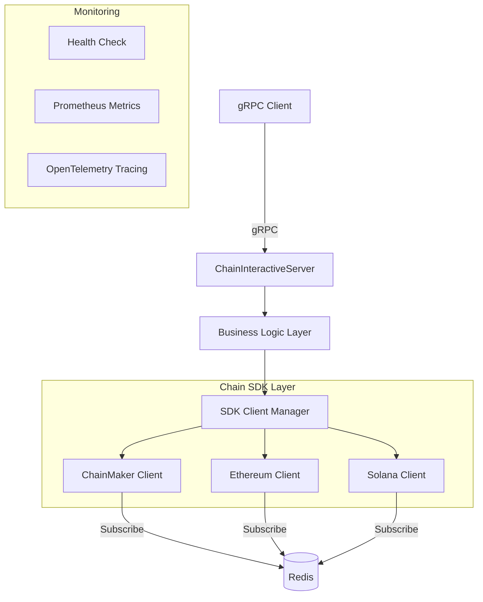

**English** | **[中文](README_CN.md)** | **[📖 Usage Guide](USAGE.md)**

# Chain Interactive Service

A universal blockchain interaction service that provides a unified gRPC interface to interact with multiple blockchains (ChainMaker, Ethereum, Solana), abstracting away the underlying chain differences so that upper-layer services don't need to care about chain-specific implementation details.

## Features

- 🔗 **Multi-Chain Support**: Unified interface for ChainMaker, Ethereum, and Solana, with ongoing expansion
- 📝 **Contract Invocation**: Supports both Invoke (write) and Query (read) call modes
- 🔍 **Transaction Query**: Query transaction details and on-chain status by transaction ID
- 📡 **Event Subscription**: Subscribe to contract events and receive real-time notifications for on-chain contract changes, with automatic resubscription on failure
- ⚡ **Sync/Async**: Contract calls support both synchronous waiting and asynchronous return
- 🔒 **gRPC Security**: Supports TLS mutual authentication for gRPC communication
- 📊 **Monitoring & Tracing**: Built-in health checks, Prometheus metrics, and OpenTelemetry distributed tracing
- 🔧 **Config Validation**: Startup-time configuration validation for chain types, SDK configs, and contract configs
- 🔄 **Graceful Shutdown**: Ordered graceful shutdown with context cancellation and concurrent SDK client cleanup

## Supported Chains

| Chain | Type | Contract Call | Transaction Query | Event Subscription |
|---|---|---|---|---|
| **ChainMaker** | Consortium | ✅ | ✅ | ✅ |
| **Ethereum** | Public | ✅ | ✅ | ✅ |
| **Solana** | Public | ✅ | ✅ | ✅ |

> 🚧 More mainstream blockchains will be added gradually.

> 📖 **For detailed usage instructions, see [USAGE.md](USAGE.md)** — covers gRPC client integration, per-chain guides, event subscription, TLS configuration, monitoring, and best practices.

## Architecture



## Project Structure

```
.
├── chaininteractive.go           # Service entry point (main)
├── chaininteractive/             # Business logic layer (goctl generated)
├── internal/
│   ├── config/
│   │   └── config.go            # Configuration definitions & validation
│   ├── logic/
│   │   ├── callcontractlogic.go
│   │   ├── gettxbytxidlogic.go
│   │   └── getavailablechainandcontractnameslogic.go
│   ├── sdk/
│   │   ├── interface.go         # Unified ChainSdkInterface definition
│   │   ├── helper.go            # SDK client management, subscription scheduling
│   │   ├── chainmakerclient.go  # ChainMaker implementation
│   │   ├── ethereumclient.go    # Ethereum implementation
│   │   ├── solanaclient.go      # Solana implementation
│   │   ├── solana_codec.go      # Solana Borsh serialization & instruction encoding
│   │   └── ethtx.go             # Ethereum transaction helper
│   ├── server/
│   │   └── chaininteractiveserver.go  # gRPC server handler
│   ├── svc/
│   │   └── servicecontext.go    # Service context (SDK clients, Redis, root ctx)
│   ├── code/
│   │   └── respCode.go          # Response code definitions
│   ├── util/
│   │   └── util.go              # Utility functions
│   └── version.go               # Version info (build-time injected)
├── proto/
│   └── chaininteractive.proto   # Protobuf service & message definitions
├── pb/                          # Generated Protobuf Go code
├── etc/
│   ├── chaininteractive.yaml    # Main service configuration
│   ├── chainmaker_sdk_config.yml # ChainMaker SDK config
│   ├── notification.json        # Notification contract ABI
│   └── nft.json                 # NFT contract ABI
├── docker/
│   ├── Dockerfile               # Multi-stage Docker build
│   └── update_docker.sh
├── scripts/
│   ├── generate_code.sh         # Protobuf code generation
│   ├── generate_cert.sh         # TLS certificate generation
│   └── ut_cover.sh              # UT coverage script
└── Makefile                     # Build & development commands
```

## Quick Start

### Prerequisites

- Go 1.22+
- Redis (required for event subscription)

### Build & Run

```bash
# Build
make build

# Run directly
make start-service

# Or use the compiled binary
./chain-interactive-service -f etc/chaininteractive.yaml

# Check version
./chain-interactive-service version
```

### Configuration

The configuration file is located at `etc/chaininteractive.yaml`. Key configuration items are as follows:

#### Service Base Configuration

```yaml
Name: chaininteractive.rpc
ListenOn: 0.0.0.0:8085
Timeout: 30000
Mode: dev   # dev / test / pre / prod
```

#### gRPC Configuration

```yaml
GrpcConf:
  CaCertFile: ""           # CA root cert path (empty = no TLS)
  ServerCertFile: ""       # Server cert path
  ServerKeyFile: ""        # Server private key path
  MaxRecvMsgSize: 20971520 # 20 MB
  MaxSendMsgSize: 20971520 # 20 MB
```

#### Chain Configuration

Each chain is defined as an independent configuration block under `ChainConfs`, distinguished by `ChainType`:

**Ethereum Example:**

```yaml
ChainConfs:
  ethereum01:
    Enable: true
    ChainType: "ethereum"
    SdkConf:
      EthConf:
        ChainId: 1
        HttpUrl: "https://mainnet.infura.io/v3/YOUR_KEY"
        WebsocketUrl: "wss://mainnet.infura.io/ws/v3/YOUR_KEY"
        PrivateKey: "your-private-key-hex"
        GasLimit: 1000000
    ContractConfs:
      notification:
        EnableSubscribe: true
        ContractType: "notification"
        ContractAddr: "0x..."
        Abi: ./etc/notification.json
        DeployBlockHeight: 0
        GetHistoryEventInterval: 500       # History event polling interval (ms)
        GetHistoryEventHeightWindow: 100   # History event block height window
```

**ChainMaker Example:**

```yaml
ChainConfs:
  chainmaker01:
    Enable: true
    ChainType: "chainmaker"
    SdkConf:
      ConfFilePath: ./etc/chainmaker_sdk_config.yml
    ContractConfs:
      notification:
        EnableSubscribe: true
        ContractType: "notification"
        ContractName: "notificationv100"
        DeployBlockHeight: 5
```

**Solana Example:**

```yaml
ChainConfs:
  solana01:
    Enable: true
    ChainType: "solana"
    SdkConf:
      SolanaConf:
        RpcUrl: "https://api.mainnet-beta.solana.com"
        PrivateKey: "your-private-key-base58"
        CommitmentLevel: "confirmed"
        SkipPreflight: false
        MaxRetries: 3
    ContractConfs:
      notification:
        EnableSubscribe: true
        ContractType: "notification"
        ContractAddr: "program-id-base58"
        DeployBlockHeight: 0
        # Solana method specs (required for CallContract)
        SolanaMethods:
          notify:
            Discriminator: "e445a52e51cb9a1d"   # 8-byte Anchor discriminator (hex)
            ArgSchema:
              - Name: "msg"
                Type: "string"                    # u8/u16/u32/u64/i64/bool/string/pubkey/bytes
            Accounts:
              - Pubkey: "$fromAddress"            # Supports "$fromAddress" placeholder
                IsSigner: true
                IsWritable: true
          getState:
            Discriminator: "0000000000000000"
            QueryAccounts:
              - "$fromAddress"
```

#### Event Subscription Configuration

Event subscription depends on Redis, configured under `SubscribeConf`:

```yaml
SubscribeConf:
  ConfType: node          # node / cluster / sentinel
  RedisAddr: "127.0.0.1:6379"
  RedisUserName: ""
  RedisPassword: ""
  MasterName: ""          # Used in sentinel mode
```

## gRPC API

The service provides the following gRPC interfaces:

### CallContract — Contract Invocation

```protobuf
rpc CallContract(CallContractRequest) returns (TxResponse);
```

| Parameter | Type | Description |
|---|---|---|
| requestId | string | Request ID for log tracing |
| chainName | string | Chain configuration name |
| contractName | string | Contract configuration name |
| contractMethod | string | Contract method name |
| kvPairs | KeyValuePair[] | Contract parameter key-value pairs |
| methodType | MethodType | 1=Invoke (write), 2=Query (read) |
| withSyncResult | bool | Whether to wait for transaction result synchronously |
| txTimeout | int64 | Transaction timeout in seconds (default: 30) |

### GetTxByTxId — Query Transaction

```protobuf
rpc GetTxByTxId(GetTxByTxIdRequest) returns (TxResponse);
```

| Parameter | Type | Description |
|---|---|---|
| requestId | string | Request ID for log tracing |
| txId | string | Transaction ID |
| chainName | string | Chain configuration name |

### GetAvailableChainAndContractNames — Query Available Chains & Contracts

```protobuf
rpc GetAvailableChainAndContractNames(GetAvailableChainAndContractNamesRequest) returns (GetAvailableChainAndContractNamesResponse);
```

Returns all enabled chains and their associated contract configurations in the current service.

### Response Codes

| Code | Name | Description |
|---|---|---|
| 200000 | Success | Success |
| 600000 | ErrUnknownContractType | Unknown contract type |
| 600001 | ErrUnknownChainType | Unknown chain type |
| 600002 | ErrGetSDKClient | Failed to get SDK client |
| 600003 | ErrGetTxByTxId | Failed to get transaction by ID |
| 600004 | ErrSendTransaction | Failed to send transaction |
| 600005 | ErrReadAbiJsonFile | Failed to read ABI JSON file |
| 600006 | ErrChainNotExist | Chain does not exist |
| 600007 | ErrChainNotEnable | Chain is not enabled |

## Usage Guide

For detailed usage instructions, see **[USAGE.md](USAGE.md)**.

## Development Guide

### Generate Protobuf Code

```bash
make gen-code
```

### Run Tests

```bash
make ut
```

### Code Lint

```bash
make lint
```

### Generate TLS Certificates

```bash
make gen-cert
```

### Adding a New Chain

1. Create a new chain client file under `internal/sdk/` that implements the `ChainSdkInterface` interface:

```go
type ChainSdkInterface interface {
    CallContract(methodType pb.MethodType, contractConfigName, method string,
        args []*pb.KeyValuePair, txTimeout int64, withSyncResult bool) (string, string, error)
    GetTxByTxId(txId string) (string, bool, error)
    Stop() error
    SubscribeContractEvent(contractConf config.ContractConf, chainConfName,
        contractConfName, chainType, contractType string) error
}
```

2. Add the new chain's configuration structure in `internal/config/config.go` and update `supportedChainTypes`
3. Register the new chain's initialization logic in `internal/sdk/helper.go` (`GetSDKClient` function)
4. Add a configuration template in `etc/chaininteractive.yaml`
5. Add the new chain type to the `ChainType` enum in `proto/chaininteractive.proto`

### Docker Build

```bash
make build-docker
```

## Tech Stack

- **Framework**: [go-zero](https://github.com/zeromicro/go-zero) v1.6.2
- **Communication**: gRPC + Protobuf
- **Chain SDKs**:
  - ChainMaker: `chainmaker.org/chainmaker/sdk-go/v2` v2.3.8
  - Ethereum: `github.com/ethereum/go-ethereum` v1.14.11
  - Solana: `github.com/gagliardetto/solana-go` v1.8.3
- **Serialization**: Borsh (Solana), ABI (Ethereum)
- **Cache**: Redis (event subscription)
- **Monitoring**: OpenTelemetry + Prometheus
- **Logging**: go-zero built-in log package (file mode with daily rotation)

## License

[Apache License 2.0](LICENSE)

This project is licensed under the Apache License 2.0. You are free to use, modify, and distribute this software under the following conditions:

- ✅ Commercial use, modification, distribution, and private use
- ✅ Patent license protection granted
- ⚠️ Must preserve copyright and license notices
- ⚠️ Modified files must indicate changes
- ⚠️ Must include a copy of the license when distributing
- ❌ No warranty provided
- ❌ Author assumes no liability