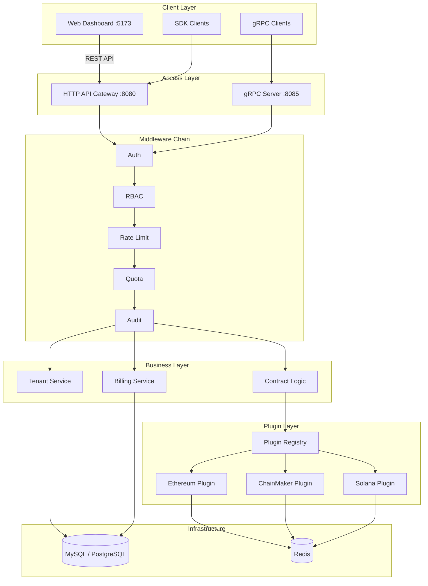

**English** | **[中文](README_CN.md)** | **[📖 Usage Guide](doc/USAGE.md)** | **[🏗️ Architecture](doc/architecture_en.md)**

# Chain Interactive Service

A universal blockchain interaction service platform (BaaS - Blockchain as a Service) that provides unified gRPC and RESTful HTTP interfaces to interact with multiple blockchains (Ethereum, ChainMaker, Solana), abstracting away the underlying chain differences so that upper-layer services don't need to care about chain-specific implementation details.

**🌐 Web Dashboard**: A modern, clean web UI built with React + Ant Design for visual management of chain configurations, contract calls, event subscriptions, usage monitoring, and more — no CLI or API knowledge required.

## ✨ Features

### Core Capabilities
- 🔗 **Multi-Chain Support**: Unified interface for Ethereum, ChainMaker, and Solana, with plugin architecture for easy expansion
- 📝 **Contract Invocation**: Supports both Invoke (write) and Query (read) call modes
- 🔍 **Transaction Query**: Query transaction details and on-chain status by transaction ID
- 📡 **Event Subscription**: Subscribe to contract events with real-time push via gRPC Server-Side Streaming
- ⚡ **Sync/Async**: Contract calls support both synchronous waiting and asynchronous return

### Commercial Features (BaaS Platform)
- 👥 **Multi-Tenancy**: Complete tenant isolation with independent chain configs, API Keys, and quotas
- 🔑 **Authentication & Authorization**: API Key authentication + RBAC role-based access control
- 💰 **Billing & Quotas**: Usage metering, quota management, bill generation, overage policies
- 🌐 **HTTP API Gateway**: RESTful API with rate limiting, making integration easy without gRPC knowledge
- 🛡️ **Security**: IP whitelist, audit logging, anomaly detection with auto-banning
- 🔌 **Plugin Architecture**: Standardized chain plugin interface for rapid integration of new chains
- 📊 **Admin Dashboard API**: Usage statistics, call logs, billing, audit log queries

### Infrastructure
- 🌐 **Web Dashboard**: Modern React + Ant Design 5.x UI with dark sidebar, ECharts monitoring, Monaco editor
- 🔒 **gRPC Security**: Supports TLS mutual authentication
- 📊 **Monitoring & Tracing**: Prometheus metrics + OpenTelemetry distributed tracing
- ☸️ **Kubernetes Ready**: Helm Chart with HPA auto-scaling, PDB, leader election
- 🔄 **High Availability**: Stateless horizontal scaling, distributed leader election for subscriptions

## Supported Chains

| Chain | Type | Contract Call | Transaction Query | Event Subscription |
|---|---|---|---|---|
| **Ethereum** | Public | ✅ | ✅ | ✅ |
| **ChainMaker** | Consortium | ✅ | ✅ | ✅ |
| **Solana** | Public | ✅ | ✅ | ✅ |

> 🚧 More chains can be added via the plugin architecture (Polygon, BSC, Avalanche, Aptos, Sui, Fabric, etc.)

## Architecture


```mermaid
graph TB
    subgraph "Client Layer"
        Dashboard[Web Dashboard :5173]
        SDK[SDK Clients]
        GRPC[gRPC Clients]
    end

    subgraph "Access Layer"
        GW[HTTP API Gateway :8080]
        GS[gRPC Server :8085]
    end

    subgraph "Middleware Chain"
        AUTH[Auth] --> RBAC2[RBAC] --> RL[Rate Limit] --> QT[Quota] --> AD[Audit]
    end

    subgraph "Business Layer"
        TS[Tenant Service]
        BS[Billing Service]
        CL[Contract Logic]
    end

    subgraph "Plugin Layer"
        PR[Plugin Registry]
        EP[Ethereum Plugin]
        CP[ChainMaker Plugin]
        SP[Solana Plugin]
    end

    subgraph "Infrastructure"
        DB[(MySQL / PostgreSQL)]
        RD[(Redis)]
    end

    Dashboard -->|REST API| GW
    SDK --> GW
    GRPC --> GS
    GW --> AUTH
    GS --> AUTH
    AD --> TS
    AD --> BS
    AD --> CL
    CL --> PR
    PR --> EP
    PR --> CP
    PR --> SP
    TS --> DB
    BS --> DB
    EP --> RD
    CP --> RD
    SP --> RD
```

> 📖 For detailed architecture diagrams and explanations, see **[Architecture Document](doc/architecture_en.md)**

## Project Structure

```
.
├── chaininteractive.go           # Service entry point (gRPC + HTTP Gateway)
├── api/
│   └── chaininteractive.api      # go-zero API definition (goctl generated)
├── internal/
│   ├── config/                   # Configuration definitions
│   ├── handler/                  # HTTP route handlers (goctl generated)
│   │   ├── routes.go            # Route registration
│   │   ├── chain/               # Contract call & tx query handlers
│   │   ├── chainconfig/         # Chain config CRUD handlers
│   │   ├── contractconfig/      # Contract config CRUD handlers
│   │   ├── event/               # Event subscription handlers
│   │   ├── tenant/              # Tenant management handlers
│   │   ├── apikey/              # API Key handlers
│   │   ├── user/                # User management handlers
│   │   └── dashboard/           # Dashboard & analytics handlers
│   ├── logic/
│   │   ├── grpc/                # gRPC business logic
│   │   └── http/                # HTTP business logic (by module)
│   │       ├── chain/
│   │       ├── chainconfig/
│   │       ├── contractconfig/
│   │       ├── event/
│   │       ├── tenant/
│   │       ├── apikey/
│   │       ├── user/
│   │       └── dashboard/
│   ├── types/                    # HTTP request/response type definitions
│   ├── sdk/                      # Chain SDK clients & tenant SDK manager
│   ├── store/                    # Data models, DB connection, repository
│   ├── service/                  # Config resolver (DB → runtime config)
│   ├── middleware/               # Auth, RBAC, rate limit, quota, audit, anomaly
│   ├── billing/                  # Billing & quota service
│   ├── tenant/                   # Tenant management service
│   ├── plugin/                   # Plugin registry & built-in adapters
│   ├── deploy/                   # Leader election (HA)
│   ├── server/                   # gRPC server registration
│   ├── svc/                      # Service context (DI container)
│   └── validator/                # Configuration validation
├── web/                          # Web Dashboard (React + Vite + Ant Design)
│   ├── src/
│   │   ├── pages/               # Page components (dashboard, chain-config, etc.)
│   │   ├── components/          # Shared layout & common components
│   │   ├── services/            # API client (axios)
│   │   ├── stores/              # State management (zustand)
│   │   ├── router/              # React Router configuration
│   │   ├── hooks/               # Custom hooks
│   │   └── styles/              # Global CSS & theme tokens
│   ├── package.json
│   └── vite.config.ts
├── proto/                        # Protobuf service definitions
├── pb/                           # Generated Protobuf Go code
├── deploy/helm/                  # Kubernetes Helm Chart
├── docker/                       # Docker build files
├── etc/                          # Configuration files
├── scripts/                      # Utility scripts
└── doc/                          # Documentation
```

## Quick Start

### Prerequisites

- Go 1.22+
- Node.js 18+ (for Web Dashboard)
- MySQL or PostgreSQL (multi-tenant data)
- Redis (event subscription & caching)

### Build & Run

```bash
# Build backend
make build

# Run backend service (gRPC :8085 + HTTP Gateway :8080)
./chain-interactive-service -f etc/chaininteractive.yaml

# Or run directly
make start-service

# Check version
./chain-interactive-service version
```

### Web Dashboard

```bash
cd web

# Install dependencies
npm install

# Development mode (default: http://localhost:5173)
npm run dev

# Production build
npm run build
```

The Web Dashboard connects to the HTTP API Gateway at `http://localhost:8080/api/v1`.

### Configuration

The configuration file is located at `etc/chaininteractive.yaml`. Key sections:

```yaml
# Service base config
Name: chaininteractive.rpc
ListenOn: 0.0.0.0:8085

# HTTP Gateway
GatewayConf:
  Enable: true
  Host: 0.0.0.0
  Port: 8080
  RateLimit: 10

# Database (multi-tenant storage)
DatabaseConf:
  Type: mysql    # mysql / postgres / kingbase_mysql / kingbase_pgsql
  DSN: root:password@tcp(localhost:3306)/chainservice?charset=utf8&parseTime=true

# Redis (event subscription)
SubscribeConf:
  ConfType: node
  RedisAddr: "127.0.0.1:6379"
```

> 📖 For complete configuration reference, see **[Usage Guide](doc/USAGE.md)**

## API Overview

### gRPC Interfaces (port 8085)

| Method | Description |
|--------|-------------|
| `CallContract` | Call/query on-chain contracts |
| `GetTxByTxId` | Query transaction by TX ID |
| `GetAvailableChainAndContractNames` | Get available chains and contracts |
| `SubscribeContractEvents` | Stream contract events (Server-Side Streaming) |

### RESTful HTTP API (port 8080)

| Category | Endpoints | Description |
|----------|-----------|-------------|
| **Contract** | `POST /api/v1/contract/call` | Call/query contracts |
| **Transaction** | `GET /api/v1/tx/:txId` | Query transaction by ID |
| **Chain** | `GET /api/v1/chains`, `GET /api/v1/chains/:chainName/status` | List chains, check status |
| **Event** | `GET /api/v1/events/subscriptions`, `POST /api/v1/events/subscribe-by-contract`, `DELETE .../subscribe-by-contract/:id` | Event subscription management |
| **Tenant** | `POST/GET /api/v1/tenants`, `POST .../disable\|enable` | Tenant management |
| **API Key** | `POST/GET /api/v1/api-keys` | API Key management |
| **Chain Config** | `CRUD /api/v1/chain-configs`, `POST .../test-connection` | Chain configuration |
| **Contract Config** | `CRUD /api/v1/chain-configs/:chainConfigId/contracts` | Contract configuration |
| **User** | `GET /api/v1/users` | User management |
| **Dashboard** | `GET /api/v1/dashboard/overview\|call-logs\|usage-stats\|bills\|audit-logs` | Analytics & monitoring |

> 📖 For complete API reference, see **[Usage Guide](doc/USAGE.md)**

## Development Guide

### Generate Protobuf Code

```bash
make gen-code
```

### Generate HTTP Handlers (goctl)

The HTTP API is defined in `api/chaininteractive.api` and handlers are generated via `goctl`:

```bash
goctl api go -api api/chaininteractive.api -dir . -style goZero
```

### Run Tests

```bash
make ut
```

### Code Lint

```bash
make lint
```

### Pre-commit Check

```bash
make pre-commit   # lint + ut + comment coverage
```

### Adding a New Chain (Plugin)

1. Implement the `ChainPlugin` interface in `internal/plugin/`
2. Register the plugin factory in `RegisterBuiltinPlugins()`
3. Add configuration structure in `internal/config/config.go`

> 📖 For detailed plugin development guide, see **[Architecture Document](doc/architecture_en.md#6-plugin-architecture)**

### Docker Build

```bash
make build-docker
```

### Kubernetes Deployment

```bash
# Install with Helm
helm install chain-interactive ./deploy/helm \
  --set database.host=your-db-host \
  --set redis.addr=your-redis:6379

# Upgrade
helm upgrade chain-interactive ./deploy/helm -f custom-values.yaml
```

## Tech Stack

| Category | Technology | Version |
|----------|-----------|---------|
| **Framework** | [go-zero](https://github.com/zeromicro/go-zero) | v1.6.2 |
| **API Generation** | [goctl](https://go-zero.dev/docs/tasks/cli/api-format) | - |
| **Communication** | gRPC + Protobuf | - |
| **Database** | MySQL / PostgreSQL (GORM) | - |
| **Cache** | Redis | - |
| **Chain SDKs** | go-ethereum, chainmaker-sdk-go, solana-go | v1.14.11, v2.3.8, v1.8.3 |
| **Monitoring** | Prometheus + OpenTelemetry | - |
| **Deployment** | Kubernetes + Helm + Docker | - |
| **Frontend** | React 19 + Vite + Ant Design 5.x + ECharts | - |
| **State** | Zustand | v5 |
| **Routing** | React Router | v7 |

## Web Dashboard Pages

| Page | Description |
|------|-------------|
| **Dashboard** | Overview with key metrics, call trend charts |
| **Chain Config** | CRUD chain configurations with connection testing |
| **Contract Config** | Manage contracts per chain (ABI, subscription settings) |
| **Contract Call** | Interactive contract invocation with Monaco editor |
| **Transaction Query** | Query and inspect transaction details |
| **Event Subscription** | Subscribe to contract events, gRPC streaming push |
| **Tenant Management** | Create/disable/enable tenants |
| **API Key** | Generate and manage API keys |
| **User Management** | View and manage users |
| **Call Logs** | Filterable call history |
| **Usage Stats** | Usage analytics with charts |
| **Bills** | Billing records |
| **Audit Logs** | Security audit trail |
| **Settings** | System settings |

## Documentation

| Document | Description |
|----------|-------------|
| **[Architecture (EN)](doc/architecture_en.md)** | System architecture, module design, deployment diagrams |
| **[Architecture (CN)](doc/architecture_cn.md)** | 系统架构、模块设计、部署架构图 |
| **[Usage Guide (EN)](doc/USAGE.md)** | API reference, chain-specific guides, best practices |
| **[Usage Guide (CN)](doc/USAGE_CN.md)** | API 参考、各链使用指南、最佳实践 |

## License

[Apache License 2.0](LICENSE)

This project is licensed under the Apache License 2.0. You are free to use, modify, and distribute this software under the following conditions:

- ✅ Commercial use, modification, distribution, and private use
- ✅ Patent license protection granted
- ⚠️ Must preserve copyright and license notices
- ⚠️ Modified files must indicate changes
- ⚠️ Must include a copy of the license when distributing
- ❌ No warranty provided
- ❌ Author assumes no liability