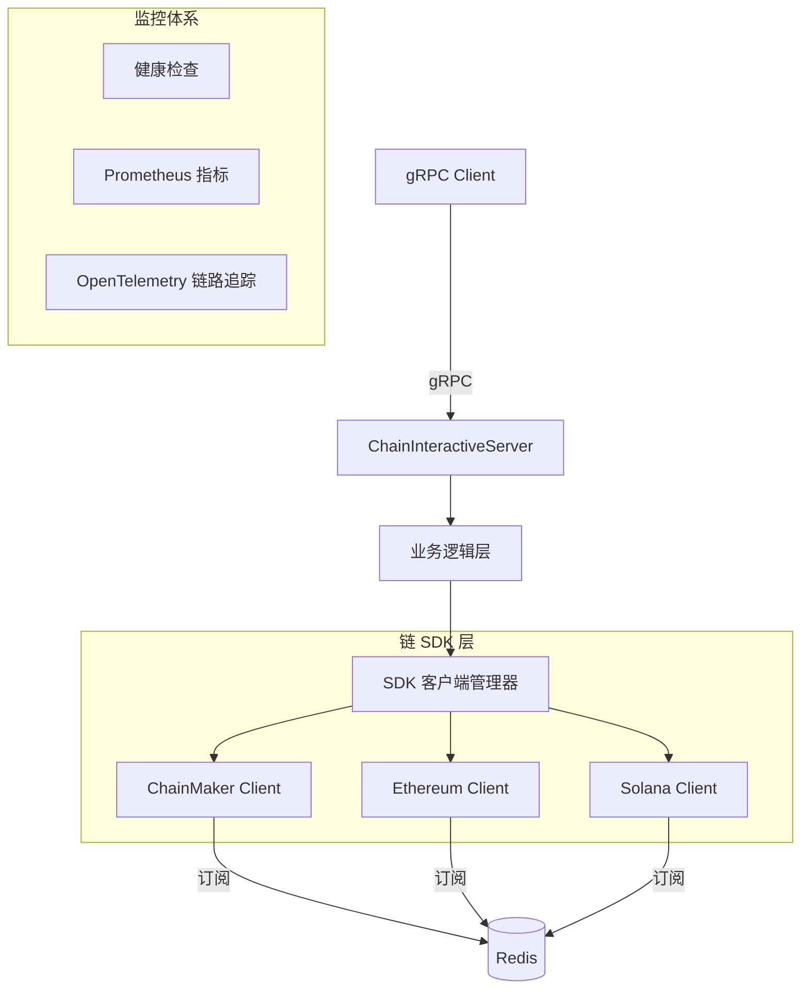

**[English](README.md)** | **中文** | **[📖 使用指南](USAGE_CN.md)**

# Chain Interactive Service

通用区块链交互服务，提供统一的 gRPC 接口与多种区块链（ChainMaker、Ethereum、Solana）进行交互，屏蔽底层链的差异，让上层业务无需关心链的具体实现细节。

## 功能特性

- 🔗 **多链支持**：统一接口对接 ChainMaker、Ethereum、Solana，后续持续扩展
- 📝 **合约调用**：支持 Invoke（写链）和 Query（读链）两种调用模式
- 🔍 **交易查询**：根据交易 ID 查询交易详情及上链状态
- 📡 **事件订阅**：订阅合约事件，实时获取链上合约变更通知，异常退出后自动重新订阅
- ⚡ **同步/异步**：合约调用支持同步等待结果或异步返回
- 🔒 **gRPC 安全**：支持 TLS 双向认证的 gRPC 通信
- 📊 **监控追踪**：内置健康检查、Prometheus 指标、OpenTelemetry 链路追踪
- 🔧 **配置校验**：启动时自动校验链类型、SDK 配置、合约配置的合法性
- 🔄 **优雅退出**：有序优雅退出，通过 context 取消通知订阅协程，并发释放 SDK 客户端资源

## 支持的链

| 链 | 类型 | 合约调用 | 交易查询 | 事件订阅 |
|---|---|---|---|---|
| **ChainMaker** | 联盟链 | ✅ | ✅ | ✅ |
| **Ethereum** | 公链 | ✅ | ✅ | ✅ |
| **Solana** | 公链 | ✅ | ✅ | ✅ |

> 🚧 后续将逐步增加更多主流区块链的对接支持。

> 📖 **详细使用说明请参阅 [USAGE_CN.md](USAGE_CN.md)** — 涵盖 gRPC 客户端集成、各链使用指南、事件订阅、TLS 配置、监控与最佳实践。

## 架构图



## 项目结构

```
.
├── chaininteractive.go           # 服务入口（main）
├── chaininteractive/             # 业务逻辑层（goctl 生成）
├── internal/
│   ├── config/
│   │   └── config.go            # 配置定义与校验
│   ├── logic/
│   │   ├── callcontractlogic.go
│   │   ├── gettxbytxidlogic.go
│   │   └── getavailablechainandcontractnameslogic.go
│   ├── sdk/
│   │   ├── interface.go         # 统一 ChainSdkInterface 定义
│   │   ├── helper.go            # SDK 客户端管理、订阅调度
│   │   ├── chainmakerclient.go  # ChainMaker 实现
│   │   ├── ethereumclient.go    # Ethereum 实现
│   │   ├── solanaclient.go      # Solana 实现
│   │   ├── solana_codec.go      # Solana Borsh 序列化与指令编码
│   │   └── ethtx.go             # Ethereum 交易辅助
│   ├── server/
│   │   └── chaininteractiveserver.go  # gRPC 服务端处理器
│   ├── svc/
│   │   └── servicecontext.go    # 服务上下文（SDK 客户端、Redis、根 ctx）
│   ├── code/
│   │   └── respCode.go          # 返回码定义
│   ├── util/
│   │   └── util.go              # 工具函数
│   └── version.go               # 版本信息（编译时注入）
├── proto/
│   └── chaininteractive.proto   # Protobuf 服务与消息定义
├── pb/                          # 生成的 Protobuf Go 代码
├── etc/
│   ├── chaininteractive.yaml    # 主服务配置文件
│   ├── chainmaker_sdk_config.yml # ChainMaker SDK 配置
│   ├── notification.json        # 消息通知合约 ABI
│   └── nft.json                 # NFT 合约 ABI
├── docker/
│   ├── Dockerfile               # 多阶段 Docker 构建
│   └── update_docker.sh
├── scripts/
│   ├── generate_code.sh         # Protobuf 代码生成
│   ├── generate_cert.sh         # TLS 证书生成
│   └── ut_cover.sh              # UT 覆盖率脚本
└── Makefile                     # 构建与开发命令
```

## 快速开始

### 环境要求

- Go 1.22+
- Redis（事件订阅依赖）

### 编译运行

```bash
# 编译
make build

# 直接运行
make start-service

# 或使用编译产物
./chain-interactive-service -f etc/chaininteractive.yaml

# 查看版本信息
./chain-interactive-service version
```

### 配置说明

配置文件位于 `etc/chaininteractive.yaml`，主要配置项如下：

#### 服务基础配置

```yaml
Name: chaininteractive.rpc
ListenOn: 0.0.0.0:8085
Timeout: 30000
Mode: dev   # dev / test / pre / prod
```

#### gRPC 配置

```yaml
GrpcConf:
  CaCertFile: ""           # CA 根证书路径（空=不启用 TLS）
  ServerCertFile: ""       # 服务端证书路径
  ServerKeyFile: ""        # 服务端私钥路径
  MaxRecvMsgSize: 20971520 # 20 MB
  MaxSendMsgSize: 20971520 # 20 MB
```

#### 链配置

每条链在 `ChainConfs` 下以独立配置块定义，通过 `ChainType` 区分链类型：

**Ethereum 配置示例：**

```yaml
ChainConfs:
  ethereum01:
    Enable: true
    ChainType: "ethereum"
    SdkConf:
      EthConf:
        ChainId: 1
        HttpUrl: "https://mainnet.infura.io/v3/YOUR_KEY"
        WebsocketUrl: "wss://mainnet.infura.io/ws/v3/YOUR_KEY"
        PrivateKey: "your-private-key-hex"
        GasLimit: 1000000
    ContractConfs:
      notification:
        EnableSubscribe: true
        ContractType: "notification"
        ContractAddr: "0x..."
        Abi: ./etc/notification.json
        DeployBlockHeight: 0
        GetHistoryEventInterval: 500       # 轮训历史事件间隔时间（ms）
        GetHistoryEventHeightWindow: 100   # 轮训历史事件区块高度窗口大小
```

**ChainMaker 配置示例：**

```yaml
ChainConfs:
  chainmaker01:
    Enable: true
    ChainType: "chainmaker"
    SdkConf:
      ConfFilePath: ./etc/chainmaker_sdk_config.yml
    ContractConfs:
      notification:
        EnableSubscribe: true
        ContractType: "notification"
        ContractName: "notificationv100"
        DeployBlockHeight: 5
```

**Solana 配置示例：**

```yaml
ChainConfs:
  solana01:
    Enable: true
    ChainType: "solana"
    SdkConf:
      SolanaConf:
        RpcUrl: "https://api.mainnet-beta.solana.com"
        PrivateKey: "your-private-key-base58"
        CommitmentLevel: "confirmed"
        SkipPreflight: false
        MaxRetries: 3
    ContractConfs:
      notification:
        EnableSubscribe: true
        ContractType: "notification"
        ContractAddr: "program-id-base58"
        DeployBlockHeight: 0
        # Solana 方法调用规范（CallContract 必需）
        SolanaMethods:
          notify:
            Discriminator: "e445a52e51cb9a1d"   # 8 字节 Anchor discriminator（hex）
            ArgSchema:
              - Name: "msg"
                Type: "string"                    # u8/u16/u32/u64/i64/bool/string/pubkey/bytes
            Accounts:
              - Pubkey: "$fromAddress"            # 支持 "$fromAddress" 占位符
                IsSigner: true
                IsWritable: true
          getState:
            Discriminator: "0000000000000000"
            QueryAccounts:
              - "$fromAddress"
```

#### 事件订阅配置

事件订阅依赖 Redis，在 `SubscribeConf` 中配置：

```yaml
SubscribeConf:
  ConfType: node          # node / cluster / sentinel
  RedisAddr: "127.0.0.1:6379"
  RedisUserName: ""
  RedisPassword: ""
  MasterName: ""          # 哨兵模式使用
```

## gRPC 接口

服务提供以下 gRPC 接口：

### CallContract — 合约调用

```protobuf
rpc CallContract(CallContractRequest) returns (TxResponse);
```

| 参数 | 类型 | 说明 |
|---|---|---|
| requestId | string | 请求 ID，日志追踪 |
| chainName | string | 链配置名称 |
| contractName | string | 合约配置名称 |
| contractMethod | string | 合约方法名 |
| kvPairs | KeyValuePair[] | 合约参数键值对 |
| methodType | MethodType | 1=Invoke(写链)，2=Query(读链) |
| withSyncResult | bool | 是否同步等待交易结果 |
| txTimeout | int64 | 交易超时时间（秒，默认30） |

### GetTxByTxId — 查询交易

```protobuf
rpc GetTxByTxId(GetTxByTxIdRequest) returns (TxResponse);
```

| 参数 | 类型 | 说明 |
|---|---|---|
| requestId | string | 请求 ID，日志追踪 |
| txId | string | 交易 ID |
| chainName | string | 链配置名称 |

### GetAvailableChainAndContractNames — 查询可用链与合约

```protobuf
rpc GetAvailableChainAndContractNames(GetAvailableChainAndContractNamesRequest) returns (GetAvailableChainAndContractNamesResponse);
```

返回当前服务中所有已启用的链及其下属合约配置信息。

### 返回码说明

| 返回码 | 名称 | 说明 |
|---|---|---|
| 200000 | Success | 成功 |
| 600000 | ErrUnknownContractType | 未知合约类型 |
| 600001 | ErrUnknownChainType | 未知链类型 |
| 600002 | ErrGetSDKClient | 获取 SDK 客户端失败 |
| 600003 | ErrGetTxByTxId | 查询交易失败 |
| 600004 | ErrSendTransaction | 发送交易失败 |
| 600005 | ErrReadAbiJsonFile | 读取 ABI JSON 文件失败 |
| 600006 | ErrChainNotExist | 链不存在 |
| 600007 | ErrChainNotEnable | 链未启用 |

## 使用指南

详细使用说明请参阅 **[USAGE_CN.md](USAGE_CN.md)**。

## 开发指南

### 生成 Protobuf 代码

```bash
make gen-code
```

### 运行测试

```bash
make ut
```

### 代码检查

```bash
make lint
```

### 生成 TLS 证书

```bash
make gen-cert
```

### 添加新链支持

1. 在 `internal/sdk/` 下创建新的链客户端文件，实现 `ChainSdkInterface` 接口：

```go
type ChainSdkInterface interface {
    CallContract(methodType pb.MethodType, contractConfigName, method string,
        args []*pb.KeyValuePair, txTimeout int64, withSyncResult bool) (string, string, error)
    GetTxByTxId(txId string) (string, bool, error)
    Stop() error
    SubscribeContractEvent(contractConf config.ContractConf, chainConfName,
        contractConfName, chainType, contractType string) error
}
```

2. 在 `internal/config/config.go` 中添加新链的配置结构，并更新 `supportedChainTypes`
3. 在 `internal/sdk/helper.go` 的 `GetSDKClient` 函数中注册新链的初始化逻辑
4. 在 `etc/chaininteractive.yaml` 中添加配置模板
5. 在 `proto/chaininteractive.proto` 的 `ChainType` 枚举中添加新链类型

### Docker 构建

```bash
make build-docker
```

## 技术栈

- **框架**：[go-zero](https://github.com/zeromicro/go-zero) v1.6.2
- **通信**：gRPC + Protobuf
- **链 SDK**：
  - ChainMaker: `chainmaker.org/chainmaker/sdk-go/v2` v2.3.8
  - Ethereum: `github.com/ethereum/go-ethereum` v1.14.11
  - Solana: `github.com/gagliardetto/solana-go` v1.8.3
- **序列化**：Borsh（Solana）、ABI（Ethereum）
- **缓存**：Redis（事件订阅）
- **监控**：OpenTelemetry + Prometheus
- **日志**：go-zero 自带日志包（文件模式，按天切割）

## License

[Apache License 2.0](LICENSE)

本项目采用 Apache License 2.0 开源协议。在遵守以下条件的前提下，您可以自由使用、修改和分发本软件：

- ✅ 商业使用、修改、分发、私人使用
- ✅ 提供专利授权保护
- ⚠️ 必须保留版权和许可声明
- ⚠️ 修改的文件必须注明变更
- ⚠️ 分发时必须包含许可副本
- ❌ 不提供任何担保
- ❌ 作者不承担任何责任