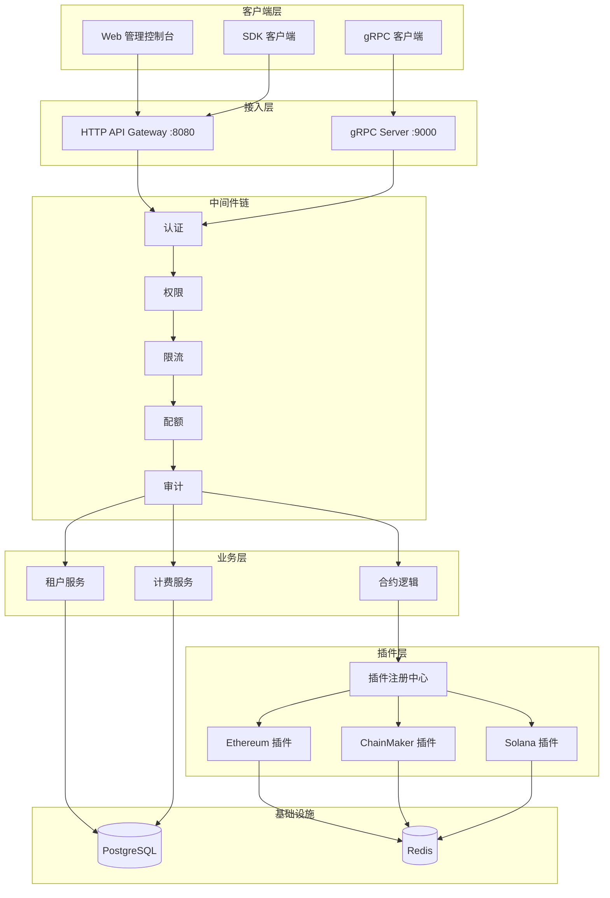

**[English](README.md)** | **中文** | **[📖 使用指南](doc/USAGE_CN.md)** | **[🏗️ 架构文档](doc/architecture_cn.md)**

# Chain Interactive Service

通用区块链交互服务平台（BaaS - Blockchain as a Service），提供统一的 gRPC 和 RESTful HTTP 接口与多种区块链（Ethereum、ChainMaker、Solana）进行交互，屏蔽底层链差异，使上层业务无需关心链的具体实现细节。

## ✨ 功能特性

### 核心能力
- 🔗 **多链支持**：统一接口对接 Ethereum、ChainMaker、Solana，插件化架构支持快速扩展
- 📝 **合约调用**：支持 Invoke（写）和 Query（读）两种调用模式
- 🔍 **交易查询**：根据交易 ID 查询交易详情和链上状态
- 📡 **事件订阅**：订阅合约事件，失败自动重连重订阅
- ⚡ **同步/异步**：合约调用支持同步等待和异步返回

### 商业化功能（BaaS 平台）
- 👥 **多租户体系**：完整的租户隔离，独立的链配置、API Key 和配额
- 🔑 **认证鉴权**：API Key 认证 + RBAC 基于角色的访问控制
- 💰 **计费与配额**：用量计量、配额管理、账单生成、超额策略
- 🌐 **HTTP API Gateway**：RESTful API + 限流，无需 gRPC 知识即可轻松集成
- 🛡️ **安全体系**：IP 白名单、审计日志、异常检测自动封禁、敏感数据脱敏
- 🔌 **插件化架构**：标准化链插件接口，快速接入新链
- 📊 **管理后台 API**：用量统计、调用日志、账单查询、审计日志

### 基础设施
- 🔒 **gRPC 安全**：支持 TLS 双向认证
- 📊 **监控追踪**：Prometheus 指标 + OpenTelemetry 分布式追踪
- ☸️ **Kubernetes 就绪**：Helm Chart + HPA 自动伸缩 + PDB + Leader 选举
- 🔄 **高可用**：无状态水平扩展，分布式 Leader 选举保障订阅任务唯一执行

## 支持的链

| 链 | 类型 | 合约调用 | 交易查询 | 事件订阅 |
|---|---|---|---|---|
| **Ethereum** | 公链 | ✅ | ✅ | ✅ |
| **ChainMaker** | 联盟链 | ✅ | ✅ | ✅ |
| **Solana** | 公链 | ✅ | ✅ | ✅ |

> 🚧 通过插件架构可快速接入更多链（Polygon、BSC、Avalanche、Aptos、Sui、Fabric 等）

## 架构



> 📖 详细架构图和说明请参阅 **[架构文档](doc/architecture_cn.md)**

## 项目结构

```
.
├── chaininteractive.go           # 服务主入口
├── internal/
│   ├── config/                   # 配置定义与校验
│   ├── logic/                    # gRPC 业务逻辑
│   ├── sdk/                      # 链 SDK 客户端 & 租户级 SDK 管理器
│   ├── store/                    # 数据模型、数据库连接、Repository
│   ├── gateway/                  # HTTP API Gateway（路由、Handler）
│   ├── middleware/               # 认证、权限、限流、配额、审计、异常检测
│   ├── billing/                  # 计费与配额服务
│   ├── tenant/                   # 租户管理服务
│   ├── plugin/                   # 插件注册中心 & 内置适配器
│   ├── deploy/                   # Leader 选举（高可用）
│   ├── server/                   # gRPC 服务注册
│   └── svc/                      # 服务上下文（依赖注入容器）
├── proto/                        # Protobuf 服务定义
├── pb/                           # 生成的 Protobuf Go 代码
├── deploy/helm/                  # Kubernetes Helm Chart
├── docker/                       # Docker 构建文件
├── etc/                          # 配置文件
├── scripts/                      # 工具脚本
└── doc/                          # 文档
    ├── architecture_cn.md        # 架构文档（中文）
    ├── architecture_en.md        # 架构文档（英文）
    ├── USAGE_CN.md               # 使用指南（中文）
    └── USAGE.md                  # 使用指南（英文）
```

## 快速开始

### 前置条件

- Go 1.22+
- PostgreSQL（多租户数据存储）
- Redis（事件订阅与缓存）

### 构建与运行

```bash
# 构建
make build

# 运行
./chain-interactive-service -f etc/chaininteractive.yaml

# 或直接运行
make start-service

# 查看版本
./chain-interactive-service version
```

### 配置

配置文件位于 `etc/chaininteractive.yaml`，主要配置项：

```yaml
# 服务基础配置
Name: chaininteractive.rpc
ListenOn: 0.0.0.0:9000

# HTTP Gateway
GatewayConf:
  Enable: true
  Port: 8080
  RateLimit: 10

# 数据库（多租户存储）
DatabaseConf:
  Driver: postgres
  Host: localhost
  Port: 5432
  DBName: chain_interactive
  AutoMigrate: true

# Redis（事件订阅）
SubscribeConf:
  ConfType: node
  RedisAddr: "127.0.0.1:6379"

# 链配置
ChainConfs:
  ethereum01:
    Enable: true
    ChainType: "ethereum"
    # ...
```

> 📖 完整配置参考请查看 **[使用指南](doc/USAGE_CN.md)**

## API 概览

### gRPC 接口

| 方法 | 描述 |
|------|------|
| `CallContract` | 调用/查询链上合约 |
| `GetTxByTxId` | 根据交易 ID 查询交易 |
| `GetAvailableChainAndContractNames` | 获取可用链和合约列表 |

### RESTful HTTP API

| 分类 | 接口 | 描述 |
|------|------|------|
| **合约** | `POST /api/v1/contract/call`, `GET /api/v1/transaction/:txId` | 合约操作 |
| **租户** | `POST/GET /api/v1/tenants`, `POST .../disable\|enable` | 租户管理 |
| **API Key** | `POST/GET /api/v1/api-keys` | API Key 管理 |
| **链配置** | `CRUD /api/v1/chain-configs` | 链配置管理 |
| **管理后台** | `GET /api/v1/dashboard/*` | 概览、日志、统计、账单、审计 |

> 📖 完整 API 参考请查看 **[使用指南](doc/USAGE_CN.md)**

## 开发指南

### 生成 Protobuf 代码

```bash
make gen-code
```

### 运行测试

```bash
make ut
```

### 代码检查

```bash
make lint
```

### 添加新链（插件）

1. 在 `internal/plugin/` 中实现 `ChainPlugin` 接口
2. 在 `RegisterBuiltinPlugins()` 中注册插件工厂
3. 在 `internal/config/config.go` 中添加配置结构

> 📖 详细插件开发指南请查看 **[架构文档](doc/architecture_cn.md#6-插件化架构)**

### Docker 构建

```bash
make build-docker
```

### Kubernetes 部署

```bash
# 使用 Helm 安装
helm install chain-interactive ./deploy/helm \
  --set database.host=your-pg-host \
  --set redis.addr=your-redis:6379

# 升级
helm upgrade chain-interactive ./deploy/helm -f custom-values.yaml
```

## 技术栈

| 类别 | 技术 | 版本 |
|------|------|------|
| **框架** | [go-zero](https://github.com/zeromicro/go-zero) | v1.6.2 |
| **通信** | gRPC + Protobuf | - |
| **数据库** | PostgreSQL / MySQL (GORM) | - |
| **缓存** | Redis | - |
| **链 SDK** | go-ethereum, chainmaker-sdk-go, solana-go | v1.14.11, v2.3.8, v1.8.3 |
| **监控** | Prometheus + OpenTelemetry | - |
| **部署** | Kubernetes + Helm + Docker | - |

## 文档

| 文档 | 描述 |
|------|------|
| **[架构文档（中文）](doc/architecture_cn.md)** | 系统架构、模块设计、部署架构图 |
| **[Architecture (EN)](doc/architecture_en.md)** | System architecture, module design, deployment diagrams |
| **[使用指南（中文）](doc/USAGE_CN.md)** | API 参考、各链使用指南、最佳实践 |
| **[Usage Guide (EN)](doc/USAGE.md)** | API reference, chain-specific guides, best practices |

## 许可证

[Apache License 2.0](LICENSE)

本项目采用 Apache License 2.0 许可证。您可以在以下条件下自由使用、修改和分发本软件：

- ✅ 商业使用、修改、分发和私人使用
- ✅ 授予专利许可保护
- ⚠️ 必须保留版权和许可声明
- ⚠️ 修改的文件必须标明变更
- ⚠️ 分发时必须包含许可证副本
- ❌ 不提供任何保证
- ❌ 作者不承担任何责任