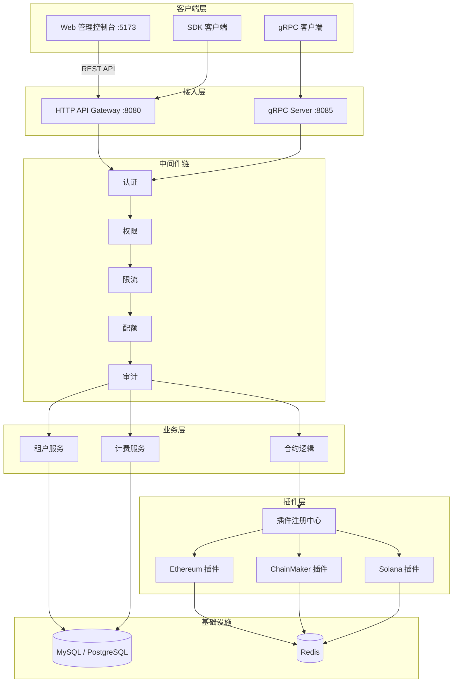

**[English](README.md)** | **中文** | **[📖 使用指南](doc/USAGE_CN.md)** | **[🏗️ 架构文档](doc/architecture_cn.md)**

# Chain Interactive Service

通用区块链交互服务平台（BaaS - Blockchain as a Service），提供统一的 gRPC 和 RESTful HTTP 接口与多种区块链（Ethereum、ChainMaker、Solana）进行交互，屏蔽底层链差异，使上层业务无需关心链的具体实现细节。

**🌐 Web 管理控制台**：基于 React + Ant Design 构建的现代化 Web UI，支持可视化管理链配置、合约调用、事件订阅、用量监控等全部操作，无需 CLI 或 API 知识。

## ✨ 功能特性

### 核心能力
- 🔗 **多链支持**：统一接口对接 Ethereum、ChainMaker、Solana，插件化架构支持快速扩展
- 📝 **合约调用**：支持 Invoke（写）和 Query（读）两种调用模式
- 🔍 **交易查询**：根据交易 ID 查询交易详情和链上状态
- 📡 **事件订阅**：通过 HTTP API 订阅合约事件，支持轮询机制
- ⚡ **同步/异步**：合约调用支持同步等待和异步返回

### 商业化功能（BaaS 平台）
- 👥 **多租户体系**：完整的租户隔离，独立的链配置、API Key 和配额
- 🔑 **认证鉴权**：API Key 认证 + RBAC 基于角色的访问控制
- 💰 **计费与配额**：用量计量、配额管理、账单生成、超额策略
- 🌐 **HTTP API Gateway**：RESTful API + 限流，无需 gRPC 知识即可轻松集成
- 🛡️ **安全体系**：IP 白名单、审计日志、异常检测自动封禁
- 🔌 **插件化架构**：标准化链插件接口，快速接入新链
- 📊 **管理后台 API**：用量统计、调用日志、账单查询、审计日志

### 基础设施
- 🌐 **Web 管理控制台**：React + Ant Design 5.x，深色侧边栏、ECharts 监控图表、Monaco 编辑器
- 🔒 **gRPC 安全**：支持 TLS 双向认证
- 📊 **监控追踪**：Prometheus 指标 + OpenTelemetry 分布式追踪
- ☸️ **Kubernetes 就绪**：Helm Chart + HPA 自动伸缩 + PDB + Leader 选举
- 🔄 **高可用**：无状态水平扩展，分布式 Leader 选举保障订阅任务唯一执行

## 支持的链

| 链 | 类型 | 合约调用 | 交易查询 | 事件订阅 |
|---|---|---|---|---|
| **Ethereum** | 公链 | ✅ | ✅ | ✅ |
| **ChainMaker** | 联盟链 | ✅ | ✅ | ✅ |
| **Solana** | 公链 | ✅ | ✅ | ✅ |

> 🚧 通过插件架构可快速接入更多链（Polygon、BSC、Avalanche、Aptos、Sui、Fabric 等）

## 架构


```mermaid
graph TB
    subgraph "客户端层"
        Dashboard[Web 管理控制台 :5173]
        SDK[SDK 客户端]
        GRPC[gRPC 客户端]
    end

    subgraph "接入层"
        GW[HTTP API Gateway :8080]
        GS[gRPC Server :8085]
    end

    subgraph "中间件链"
        AUTH[认证] --> RBAC2[权限] --> RL[限流] --> QT[配额] --> AD[审计]
    end

    subgraph "业务层"
        TS[租户服务]
        BS[计费服务]
        CL[合约逻辑]
    end

    subgraph "插件层"
        PR[插件注册中心]
        EP[Ethereum 插件]
        CP[ChainMaker 插件]
        SP[Solana 插件]
    end

    subgraph "基础设施"
        DB[(MySQL / PostgreSQL)]
        RD[(Redis)]
    end

    Dashboard -->|REST API| GW
    SDK --> GW
    GRPC --> GS
    GW --> AUTH
    GS --> AUTH
    AD --> TS
    AD --> BS
    AD --> CL
    CL --> PR
    PR --> EP
    PR --> CP
    PR --> SP
    TS --> DB
    BS --> DB
    EP --> RD
    CP --> RD
    SP --> RD
```

> 📖 详细架构图和说明请参阅 **[架构文档](doc/architecture_cn.md)**

## 项目结构

```
.
├── chaininteractive.go           # 服务主入口（gRPC + HTTP Gateway）
├── api/
│   └── chaininteractive.api      # go-zero API 定义文件（goctl 生成）
├── internal/
│   ├── config/                   # 配置定义
│   ├── handler/                  # HTTP 路由处理器（goctl 生成）
│   │   ├── routes.go            # 路由注册
│   │   ├── chain/               # 合约调用 & 交易查询
│   │   ├── chainconfig/         # 链配置 CRUD
│   │   ├── contractconfig/      # 合约配置 CRUD
│   │   ├── event/               # 事件订阅
│   │   ├── tenant/              # 租户管理
│   │   ├── apikey/              # API Key 管理
│   │   ├── user/                # 用户管理
│   │   └── dashboard/           # 仪表盘 & 分析
│   ├── logic/
│   │   ├── grpc/                # gRPC 业务逻辑
│   │   └── http/                # HTTP 业务逻辑（按模块划分）
│   │       ├── chain/
│   │       ├── chainconfig/
│   │       ├── contractconfig/
│   │       ├── event/
│   │       ├── tenant/
│   │       ├── apikey/
│   │       ├── user/
│   │       └── dashboard/
│   ├── types/                    # HTTP 请求/响应类型定义
│   ├── sdk/                      # 链 SDK 客户端 & 租户级 SDK 管理器
│   ├── store/                    # 数据模型、数据库连接、Repository
│   ├── service/                  # 配置解析器（DB → 运行时配置）
│   ├── middleware/               # 认证、权限、限流、配额、审计、异常检测
│   ├── billing/                  # 计费与配额服务
│   ├── tenant/                   # 租户管理服务
│   ├── plugin/                   # 插件注册中心 & 内置适配器
│   ├── deploy/                   # Leader 选举（高可用）
│   ├── server/                   # gRPC 服务注册
│   ├── svc/                      # 服务上下文（依赖注入容器）
│   └── validator/                # 配置校验
├── web/                          # Web 管理控制台（React + Vite + Ant Design）
│   ├── src/
│   │   ├── pages/               # 页面组件（仪表盘、链配置等）
│   │   ├── components/          # 共享布局 & 通用组件
│   │   ├── services/            # API 客户端（axios）
│   │   ├── stores/              # 状态管理（zustand）
│   │   ├── router/              # React Router 路由配置
│   │   ├── hooks/               # 自定义 Hooks
│   │   └── styles/              # 全局 CSS & 主题 Token
│   ├── package.json
│   └── vite.config.ts
├── proto/                        # Protobuf 服务定义
├── pb/                           # 生成的 Protobuf Go 代码
├── deploy/helm/                  # Kubernetes Helm Chart
├── docker/                       # Docker 构建文件
├── etc/                          # 配置文件
├── scripts/                      # 工具脚本
└── doc/                          # 文档
```

## 快速开始

### 前置条件

- Go 1.22+
- Node.js 18+（Web 管理控制台）
- MySQL 或 PostgreSQL（多租户数据存储）
- Redis（事件订阅与缓存）

### 构建与运行

```bash
# 构建后端
make build

# 运行后端服务（gRPC :8085 + HTTP Gateway :8080）
./chain-interactive-service -f etc/chaininteractive.yaml

# 或直接运行
make start-service

# 查看版本
./chain-interactive-service version
```

### Web 管理控制台

```bash
cd web

# 安装依赖
npm install

# 开发模式（默认：http://localhost:5173）
npm run dev

# 生产构建
npm run build
```

Web 管理控制台连接 HTTP API Gateway `http://localhost:8080/api/v1`。

### 配置

配置文件位于 `etc/chaininteractive.yaml`，主要配置项：

```yaml
# 服务基础配置
Name: chaininteractive.rpc
ListenOn: 0.0.0.0:8085

# HTTP Gateway
GatewayConf:
  Enable: true
  Host: 0.0.0.0
  Port: 8080
  RateLimit: 10

# 数据库（多租户存储）
DatabaseConf:
  Type: mysql    # mysql / postgres / kingbase_mysql / kingbase_pgsql
  DSN: root:password@tcp(localhost:3306)/chainservice?charset=utf8&parseTime=true

# Redis（事件订阅）
SubscribeConf:
  ConfType: node
  RedisAddr: "127.0.0.1:6379"
```

> 📖 完整配置参考请查看 **[使用指南](doc/USAGE_CN.md)**

## API 概览

### gRPC 接口（端口 8085）

| 方法 | 描述 |
|------|------|
| `CallContract` | 调用/查询链上合约 |
| `GetTxByTxId` | 根据交易 ID 查询交易 |
| `GetAvailableChainAndContractNames` | 获取可用链和合约列表 |

### RESTful HTTP API（端口 8080）

| 分类 | 接口 | 描述 |
|------|------|------|
| **合约** | `POST /api/v1/contract/call` | 调用/查询合约 |
| **交易** | `GET /api/v1/tx/:txId` | 根据 ID 查询交易 |
| **链** | `GET /api/v1/chains`, `GET /api/v1/chains/:chainName/status` | 链列表、状态查询 |
| **事件** | `POST /api/v1/events/subscribe`, `GET /api/v1/events/poll`, `DELETE /api/v1/events/subscribe/:subscriptionId` | 事件订阅 |
| **租户** | `POST/GET /api/v1/tenants`, `POST .../disable\|enable` | 租户管理 |
| **API Key** | `POST/GET /api/v1/api-keys` | API Key 管理 |
| **链配置** | `CRUD /api/v1/chain-configs`, `POST .../test-connection` | 链配置管理 |
| **合约配置** | `CRUD /api/v1/chain-configs/:chainConfigId/contracts` | 合约配置管理 |
| **用户** | `GET /api/v1/users` | 用户管理 |
| **仪表盘** | `GET /api/v1/dashboard/overview\|call-logs\|usage-stats\|bills\|audit-logs` | 分析与监控 |

> 📖 完整 API 参考请查看 **[使用指南](doc/USAGE_CN.md)**

## 开发指南

### 生成 Protobuf 代码

```bash
make gen-code
```

### 生成 HTTP Handler（goctl）

HTTP API 定义在 `api/chaininteractive.api`，通过 `goctl` 生成 handler：

```bash
goctl api go -api api/chaininteractive.api -dir . -style goZero
```

### 运行测试

```bash
make ut
```

### 代码检查

```bash
make lint
```

### 提交前检查

```bash
make pre-commit   # lint + ut + 注释覆盖率
```

### 添加新链（插件）

1. 在 `internal/plugin/` 中实现 `ChainPlugin` 接口
2. 在 `RegisterBuiltinPlugins()` 中注册插件工厂
3. 在 `internal/config/config.go` 中添加配置结构

> 📖 详细插件开发指南请查看 **[架构文档](doc/architecture_cn.md#6-插件化架构)**

### Docker 构建

```bash
make build-docker
```

### Kubernetes 部署

```bash
# 使用 Helm 安装
helm install chain-interactive ./deploy/helm \
  --set database.host=your-db-host \
  --set redis.addr=your-redis:6379

# 升级
helm upgrade chain-interactive ./deploy/helm -f custom-values.yaml
```

## 技术栈

| 类别 | 技术 | 版本 |
|------|------|------|
| **框架** | [go-zero](https://github.com/zeromicro/go-zero) | v1.6.2 |
| **API 生成** | [goctl](https://go-zero.dev/docs/tasks/cli/api-format) | - |
| **通信** | gRPC + Protobuf | - |
| **数据库** | MySQL / PostgreSQL (GORM) | - |
| **缓存** | Redis | - |
| **链 SDK** | go-ethereum, chainmaker-sdk-go, solana-go | v1.14.11, v2.3.8, v1.8.3 |
| **监控** | Prometheus + OpenTelemetry | - |
| **部署** | Kubernetes + Helm + Docker | - |
| **前端** | React 19 + Vite + Ant Design 5.x + ECharts | - |
| **状态管理** | Zustand | v5 |
| **路由** | React Router | v7 |

## Web 管理控制台页面

| 页面 | 描述 |
|------|------|
| **仪表盘** | 关键指标概览、调用趋势图表 |
| **链配置** | 链配置 CRUD，支持连接测试 |
| **合约配置** | 按链管理合约（ABI、订阅设置） |
| **合约调用** | 交互式合约调用，内置 Monaco 编辑器 |
| **交易查询** | 查询和检视交易详情 |
| **事件订阅** | 订阅/取消订阅合约事件，轮询结果 |
| **租户管理** | 创建/禁用/启用租户 |
| **API Key** | 生成和管理 API Key |
| **用户管理** | 查看和管理用户 |
| **调用日志** | 可筛选的调用历史 |
| **用量统计** | 用量分析图表 |
| **账单** | 计费记录 |
| **审计日志** | 安全审计追踪 |
| **系统设置** | 系统配置 |

## 文档

| 文档 | 描述 |
|------|------|
| **[架构文档（中文）](doc/architecture_cn.md)** | 系统架构、模块设计、部署架构图 |
| **[Architecture (EN)](doc/architecture_en.md)** | System architecture, module design, deployment diagrams |
| **[使用指南（中文）](doc/USAGE_CN.md)** | API 参考、各链使用指南、最佳实践 |
| **[Usage Guide (EN)](doc/USAGE.md)** | API reference, chain-specific guides, best practices |

## 许可证

[Apache License 2.0](LICENSE)

本项目采用 Apache License 2.0 许可证。您可以在以下条件下自由使用、修改和分发本软件：

- ✅ 商业使用、修改、分发和私人使用
- ✅ 授予专利许可保护
- ⚠️ 必须保留版权和许可声明
- ⚠️ 修改的文件必须标明变更
- ⚠️ 分发时必须包含许可证副本
- ❌ 不提供任何保证
- ❌ 作者不承担任何责任