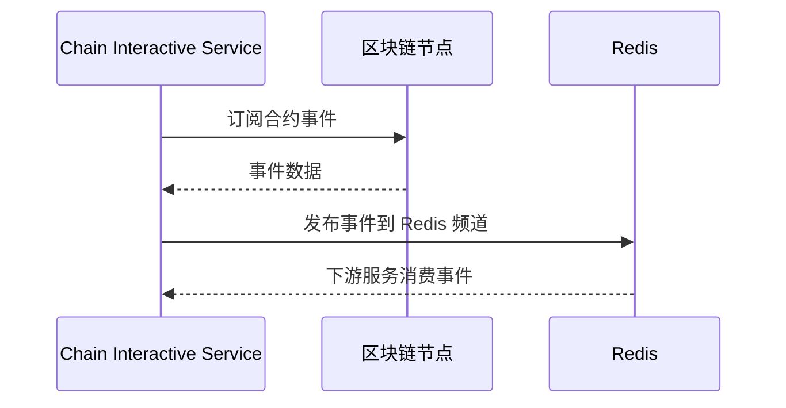

# 使用指南（中文）

本文档提供 Chain Interactive Service 的详细使用说明，包括 gRPC 客户端集成、各链特定配置和高级功能。

## 目录

- [服务启动](#服务启动)
- [gRPC 客户端集成](#grpc-客户端集成)
- [API 参考](#api-参考)
  - [CallContract](#callcontract)
  - [GetTxByTxId](#gettxbytxid)
  - [GetAvailableChainAndContractNames](#getavailablechainandcontractnames)
- [各链使用说明](#各链使用说明)
  - [Ethereum](#ethereum)
  - [ChainMaker](#chainmaker)
  - [Solana](#solana)
- [事件订阅](#事件订阅)
- [TLS 配置](#tls-配置)
- [监控](#监控)
- [错误处理](#错误处理)
- [最佳实践](#最佳实践)

---

## 服务启动

### 基本启动

```bash
# 编译并使用默认配置运行
make build
./chain-interactive-service -f etc/chaininteractive.yaml
```

### 版本检查

```bash
./chain-interactive-service version
# 输出：
# Current version: v1.1.0
# Commit hash: a1b2c3d...
# Build time: 2026-05-06 16:00:00
```

### 配置校验

服务启动时会自动校验配置，如果校验失败，服务将退出并输出错误信息：

- 缺少必要的链配置
- 不支持的链类型
- 缺少必要的 SDK 字段（如 Ethereum 的 `HttpUrl`、ChainMaker 的 `ConfFilePath`、Solana 的 `RpcUrl`）
- 私钥格式无效
- 订阅场景下缺少合约必填字段（如 Ethereum 需要 `ContractAddr`、`GetHistoryEventInterval`、`GetHistoryEventHeightWindow`）

---

## gRPC 客户端集成

### Go 客户端示例

```go
package main

import (
    "context"
    "fmt"
    "log"
    "time"

    "google.golang.org/grpc"
    "google.golang.org/grpc/credentials/insecure"
    pb "github.com/jackz-jones/blockchain-interactive-service/pb"
)

func main() {
    // 连接 gRPC 服务端
    conn, err := grpc.Dial("localhost:8085", grpc.WithTransportCredentials(insecure.NewCredentials()))
    if err != nil {
        log.Fatalf("连接失败: %v", err)
    }
    defer conn.Close()

    client := pb.NewChainInteractiveClient(conn)
    ctx, cancel := context.WithTimeout(context.Background(), 30*time.Second)
    defer cancel()

    // 示例：调用合约（Invoke 写链）
    resp, err := client.CallContract(ctx, &pb.CallContractRequest{
        RequestId:      "req-001",
        ChainName:      "ethereum01",
        ContractName:   "notification",
        ContractMethod: "sendMessage",
        KvPairs: []*pb.KeyValuePair{
            {Key: "message", Value: []byte("Hello, Blockchain!")},
        },
        MethodType:     pb.MethodType_Invoke,
        WithSyncResult: true,
        TxTimeout:      30,
    })
    if err != nil {
        log.Fatalf("CallContract 失败: %v", err)
    }
    fmt.Printf("返回码: %d, 交易ID: %s, 是否打包中: %v\n", resp.Code, resp.Data.TxId, resp.Data.Pending)

    // 示例：查询交易
    txResp, err := client.GetTxByTxId(ctx, &pb.GetTxByTxIdRequest{
        RequestId: "req-002",
        TxId:      resp.Data.TxId,
        ChainName: "ethereum01",
    })
    if err != nil {
        log.Fatalf("GetTxByTxId 失败: %v", err)
    }
    fmt.Printf("返回码: %d, 是否打包中: %v, 内容: %s\n", txResp.Code, txResp.Data.Pending, txResp.Data.Content)

    // 示例：查询可用链与合约
    availResp, err := client.GetAvailableChainAndContractNames(ctx, &pb.GetAvailableChainAndContractNamesRequest{
        RequestId: "req-003",
    })
    if err != nil {
        log.Fatalf("GetAvailableChainAndContractNames 失败: %v", err)
    }
    for _, chain := range availResp.Data {
        fmt.Printf("链: %s (类型: %s)\n", chain.ChainName, chain.ChainType)
        for _, contract := range chain.ContractDescs {
            fmt.Printf("  合约: %s (类型: %s, 地址: %s)\n",
                contract.ContractName, contract.ContractType, contract.ContractAddress)
        }
    }
}
```

### 使用 TLS 的 gRPC 连接

```go
import (
    "crypto/tls"
    "crypto/x509"
    "io/ioutil"

    "google.golang.org/grpc"
    "google.golang.org/grpc/credentials"
)

func dialWithTLS() *grpc.ClientConn {
    // 加载 CA 证书
    caCert, _ := ioutil.ReadFile("./cert/ca/ca.pem")
    certPool := x509.NewCertPool()
    certPool.AppendCertsFromPEM(caCert)

    // 加载客户端证书和私钥
    clientCert, _ := tls.LoadX509KeyPair("./cert/client/client.pem", "./cert/client/client.key")

    creds := credentials.NewTLS(&tls.Config{
        Certificates: []tls.Certificate{clientCert},
        RootCAs:      certPool,
    })

    conn, _ := grpc.Dial("localhost:8085", grpc.WithTransportCredentials(creds))
    return conn
}
```

### 使用 grpcurl 测试

在 dev/test 模式下，gRPC 反射功能已启用，可以使用 `grpcurl` 进行快速测试：

```bash
# 列出服务
grpcurl -plaintext localhost:8085 list

# 查看服务描述
grpcurl -plaintext localhost:8085 describe proto.ChainInteractive

# 调用 GetAvailableChainAndContractNames
grpcurl -plaintext -d '{"requestId":"test-001"}' localhost:8085 proto.ChainInteractive/GetAvailableChainAndContractNames

# 调用 CallContract（Ethereum Invoke）
grpcurl -plaintext -d '{
  "requestId": "test-002",
  "chainName": "ethereum01",
  "contractName": "notification",
  "contractMethod": "sendMessage",
  "kvPairs": [{"key": "message", "value": "SGVsbG8="}],
  "methodType": 1,
  "withSyncResult": true,
  "txTimeout": 30
}' localhost:8085 proto.ChainInteractive/CallContract

# 调用 GetTxByTxId
grpcurl -plaintext -d '{
  "requestId": "test-003",
  "txId": "0xabc123...",
  "chainName": "ethereum01"
}' localhost:8085 proto.ChainInteractive/GetTxByTxId
```

---

## API 参考

### CallContract

在指定链上调用或查询智能合约。

**请求：`CallContractRequest`**

| 字段 | 类型 | 必填 | 说明 |
|---|---|---|---|
| requestId | string | 否 | 请求 ID，用于日志追踪 |
| chainName | string | 是 | 链配置名称（如 `ethereum01`） |
| contractName | string | 是 | 合约配置名称（如 `notification`） |
| contractMethod | string | 是 | 要调用的合约方法 |
| kvPairs | KeyValuePair[] | 否 | 方法参数键值对 |
| methodType | MethodType | 是 | `1` = Invoke（写链），`2` = Query（读链） |
| withSyncResult | bool | 否 | 是否同步等待上链确认（默认 false） |
| txTimeout | int64 | 否 | 超时时间（秒，默认 30） |

**响应：`TxResponse`**

| 字段 | 类型 | 说明 |
|---|---|---|
| code | int32 | 返回码（200000 = 成功） |
| msg | string | 错误信息 |
| data | TxData | 交易数据 |

**`TxData` 字段：**

| 字段 | 类型 | 说明 |
|---|---|---|
| chainName | string | 链配置名称 |
| content | string | 交易结果（JSON 字符串） |
| pending | bool | `true` = 尚未确认，`false` = 已上链确认 |
| txId | string | 交易哈希/ID |

**行为细节：**

- **Invoke + `withSyncResult=true`**：服务等待交易上链确认后返回，`pending=false`。
- **Invoke + `withSyncResult=false`**：服务提交交易后立即返回，`pending=true`。
- **Query（methodType=2）**：读取合约状态，不会创建交易，`txId` 可能为空。
- **Ethereum 超时**：同步获取 receipt 超时时，交易已成功提交到节点。响应中会包含 `txId` 和超时错误信息。

### GetTxByTxId

根据交易 ID 查询交易详情和上链状态。

**请求：`GetTxByTxIdRequest`**

| 字段 | 类型 | 必填 | 说明 |
|---|---|---|---|
| requestId | string | 否 | 请求 ID，用于日志追踪 |
| txId | string | 是 | 交易哈希/ID |
| chainName | string | 是 | 链配置名称 |

**响应：`TxResponse`**（与 CallContract 相同）

`pending` 字段表示交易确认状态：
- `true`：交易待确认（尚未被打包进区块）
- `false`：交易已确认

### GetAvailableChainAndContractNames

返回所有已启用的链及其合约配置信息。

**请求：`GetAvailableChainAndContractNamesRequest`**

| 字段 | 类型 | 必填 | 说明 |
|---|---|---|---|
| requestId | string | 否 | 请求 ID，用于日志追踪 |

**响应：`GetAvailableChainAndContractNamesResponse`**

| 字段 | 类型 | 说明 |
|---|---|---|
| code | int32 | 返回码 |
| msg | string | 消息 |
| data | ChainAndContractName[] | 链与合约列表 |

**`ChainAndContractName` 字段：**

| 字段 | 类型 | 说明 |
|---|---|---|
| chainName | string | 链配置名称 |
| chainType | ChainType | 链类型枚举（0=Ethereum, 1=Chainmaker, 2=Solana） |
| contractDescs | ContractDesc[] | 合约描述列表 |

**`ContractDesc` 字段：**

| 字段 | 类型 | 说明 |
|---|---|---|
| contractName | string | 合约配置名称 |
| contractType | ContractType | 合约类型枚举（0=Notification, 1=Nft） |
| contractAddress | string | 合约地址（Ethereum/Solana） |
| abi | string | 合约 ABI JSON（仅 Ethereum） |

---

## 各链使用说明

### Ethereum

**配置：**

```yaml
ChainConfs:
  ethereum01:
    Enable: true
    ChainType: "ethereum"
    SdkConf:
      EthConf:
        ChainId: 1                                    # 链 ID（1=主网, 5=Goerli 等）
        HttpUrl: "https://mainnet.infura.io/v3/KEY"   # HTTP RPC 端点
        WebsocketUrl: "wss://mainnet.infura.io/ws/v3/KEY"  # WebSocket 端点（用于事件订阅）
        PrivateKey: "hex-私钥"                         # 签名私钥（hex 格式）
        GasLimit: 1000000                              # 交易 Gas 限制
```

**CallContract 行为：**

- **Invoke**：通过 HTTP RPC 发送签名交易。如果 `withSyncResult=true`，会轮询等待交易回执。
- **Query**：通过 `eth_call` 调用合约的只读方法。
- **参数传递**：`kvPairs` 根据合约方法名通过 ABI 文件映射到方法的输入参数。

**合约订阅配置：**

```yaml
ContractConfs:
  notification:
    EnableSubscribe: true
    ContractType: "notification"
    ContractAddr: "0x..."                    # 合约地址
    Abi: ./etc/notification.json             # ABI JSON 文件路径
    DeployBlockHeight: 0                     # 合约部署区块高度
    GetHistoryEventInterval: 500             # 轮询历史事件间隔（毫秒）
    GetHistoryEventHeightWindow: 100         # 每次轮询的区块高度窗口
```

**事件订阅机制：**

Ethereum 客户端使用轮询策略订阅事件：
1. 启动时，从 `DeployBlockHeight` 到当前区块高度批量获取历史事件。
2. 追上最新区块后，切换到基于 WebSocket 的实时事件订阅。
3. 如果 WebSocket 连接断开，会自动重连并从上次处理的区块继续。
4. 事件发布到 Redis，供下游消费者使用。

### ChainMaker

**配置：**

```yaml
ChainConfs:
  chainmaker01:
    Enable: true
    ChainType: "chainmaker"
    SdkConf:
      ConfFilePath: ./etc/chainmaker_sdk_config.yml   # ChainMaker SDK 配置文件
```

`chainmaker_sdk_config.yml` 文件包含链节点地址、用户证书等 ChainMaker SDK 所需的链特定设置。

**CallContract 行为：**

- **Invoke**：向链节点发送交易，可选择等待确认。
- **Query**：读取合约状态，不会创建交易。
- **参数传递**：`kvPairs` 以键值对形式传递给 ChainMaker SDK。

**合约订阅配置：**

```yaml
ContractConfs:
  notification:
    EnableSubscribe: true
    ContractType: "notification"
    ContractName: "notificationv100"   # 链上合约名称
    DeployBlockHeight: 5               # 合约部署高度
```

**事件订阅机制：**

ChainMaker 使用 SDK 内置的事件订阅 API。事件由链节点推送到服务，然后发布到 Redis。

### Solana

**配置：**

```yaml
ChainConfs:
  solana01:
    Enable: true
    ChainType: "solana"
    SdkConf:
      SolanaConf:
        RpcUrl: "https://api.mainnet-beta.solana.com"  # RPC 端点
        PrivateKey: "base58-私钥"                        # 签名私钥（base58 格式）
        CommitmentLevel: "confirmed"                      # processed / confirmed / finalized
        SkipPreflight: false                              # 是否跳过预检
        MaxRetries: 3                                     # 交易重试次数
```

**CallContract 行为：**

- **Invoke**：根据指令规范构建 Solana 交易，签名后发送到 RPC 节点。
  - 指令数据通过 Borsh 序列化根据 `SolanaMethods` 配置构建。
  - 账户元数据从 `Accounts` 配置中解析（支持 `$fromAddress` 占位符）。
  - 如果 `withSyncResult=true`，服务等待交易确认。
- **Query**：使用 `getMultipleAccounts` RPC 读取账户数据，根据方法的 `Discriminator` 进行解码。

**Solana 方法规范（`SolanaMethods`）：**

这是定义 Solana 合约调用编解码方式的关键配置：

```yaml
SolanaMethods:
  # 方法名（与 CallContract 请求中的 contractMethod 对应）
  notify:
    # 8 字节 Anchor discriminator（hex 字符串，16 个 hex 字符）
    Discriminator: "e445a52e51cb9a1d"
    # Borsh 序列化的参数 Schema
    ArgSchema:
      - Name: "msg"           # 必须与请求中 KeyValuePair.Key 对应
        Type: "string"        # 类型：u8, u16, u32, u64, i64, bool, string, pubkey, bytes
      - Name: "amount"
        Type: "u64"
    # Invoke 调用所需的账户列表
    Accounts:
      - Pubkey: "$fromAddress"  # 占位符，表示签名方地址
        IsSigner: true
        IsWritable: true
      - Pubkey: "SomeAccount1111111111111111111111111"
        IsSigner: false
        IsWritable: false

  # 使用 getMultipleAccounts 的查询方法
  getState:
    Discriminator: "0000000000000000"
    # 需要读取的账户地址列表（支持 "$fromAddress" 占位符）
    QueryAccounts:
      - "$fromAddress"
      - "DataAccount1111111111111111111111111111"
```

**支持的 ArgSchema 类型：**

| 类型 | 大小 | 说明 |
|---|---|---|
| u8 | 1 字节 | 无符号 8 位整数 |
| u16 | 2 字节 | 无符号 16 位整数 |
| u32 | 4 字节 | 无符号 32 位整数 |
| u64 | 8 字节 | 无符号 64 位整数 |
| i64 | 8 字节 | 有符号 64 位整数 |
| bool | 1 字节 | 布尔值（0 或 1） |
| string | 4+N 字节 | Borsh 字符串（长度前缀 + UTF-8 数据） |
| pubkey | 32 字节 | Solana 公钥（base58 输入） |
| bytes | 可变 | 原始字节（base64 输入） |

**合约订阅配置：**

```yaml
ContractConfs:
  notification:
    EnableSubscribe: true
    ContractType: "notification"
    ContractAddr: "program-id-base58"   # Solana 程序 ID（base58 格式）
    DeployBlockHeight: 0                 # 部署时的 Slot 编号
```

**事件订阅机制：**

Solana 使用基于 WebSocket 的日志订阅（`logsSubscribe`）来监控程序事件。事件解析后发布到 Redis。

---

## 事件订阅

### 概述

事件订阅系统允许您在链上合约事件发生时接收实时通知。

### 架构



### 工作原理

1. 服务启动时调用 `StartSubscribe` 函数，启动调度协程。
2. 调度器每 3 秒检查一次需要订阅的链/合约。
3. 对于已启用订阅的合约（`EnableSubscribe: true`），启动订阅协程。
4. 如果订阅协程退出（错误或断连），`SubscribeFlag` 会被清除，下次调度周期将重新订阅。
5. 服务关闭时，根 context 被取消，传播到所有订阅协程驱动其退出。

### Redis 事件格式

订阅的事件会发布到 Redis，具体的频道和格式取决于 `contractType` 和 `chainType` 配置。

### Redis 部署模式

服务支持三种 Redis 部署模式：

| 模式 | ConfType | 说明 |
|---|---|---|
| 单节点 | `node` | 单个 Redis 实例 |
| 集群 | `cluster` | Redis Cluster 多节点集群 |
| 哨兵 | `sentinel` | Redis Sentinel 高可用模式 |

```yaml
SubscribeConf:
  ConfType: sentinel
  RedisAddr: "sentinel1:26379,sentinel2:26379,sentinel3:26379"
  RedisUserName: ""
  RedisPassword: "your-password"
  MasterName: "mymaster"    # 哨兵模式必填
```

---

## TLS 配置

### 启用 gRPC TLS

1. 生成证书：

```bash
make gen-cert
# 证书将生成在 ./cert/ 目录下
```

2. 配置服务：

```yaml
GrpcConf:
  CaCertFile: ./cert/ca/ca.pem
  ServerCertFile: ./cert/chain-service/server.pem
  ServerKeyFile: ./cert/chain-service/server.key
```

3. 客户端需要加载 CA 证书和客户端证书/私钥以实现双向 TLS 认证。

### 禁用 TLS

将证书路径留空即可禁用 TLS：

```yaml
GrpcConf:
  CaCertFile: ""
  ServerCertFile: ""
  ServerKeyFile: ""
```

---

## 监控

### 健康检查

服务提供健康检查端点：

```bash
curl http://localhost:6061/healthz
# 响应：OK
```

### Prometheus 指标

Prometheus 指标可在以下端点获取：

```bash
curl http://localhost:6061/metrics
```

### OpenTelemetry 链路追踪

在服务配置中开启追踪：

```yaml
Telemetry:
  Disabled: false
  Name: chain.rpc
  Endpoint: http://jaeger:14268/api/traces
  Sampler: 1.0
  Batcher: jaeger  # jaeger / zipkin / otlpgrpc / otlphttp
```

### DevServer 配置

```yaml
DevServer:
  Enable: true
  Port: 6061
  HealthPath: "/healthz"
  HealthResponse: "OK"
  MetricsPath: "/metrics"
```

---

## 错误处理

### 返回码规则

- `200000`：成功
- `600xxx`：服务级错误

| 返回码 | 常量 | 说明 |
|---|---|---|
| 200000 | Success | 操作成功 |
| 600000 | ErrUnknownContractType | 配置中的 `ContractType` 不被识别 |
| 600001 | ErrUnknownChainType | 配置中的 `ChainType` 不被识别 |
| 600002 | ErrGetSDKClient | 创建或获取 SDK 客户端失败 |
| 600003 | ErrGetTxByTxId | 根据交易 ID 查询交易失败 |
| 600004 | ErrSendTransaction | 发送交易到链上失败 |
| 600005 | ErrReadAbiJsonFile | 读取 ABI JSON 文件失败（Ethereum） |
| 600006 | ErrChainNotExist | 指定的 `chainName` 在配置中不存在 |
| 600007 | ErrChainNotEnable | 指定的链存在但未启用 |

### Ethereum 交易超时

在 Ethereum 上使用 `withSyncResult=true` 调用 `CallContract` 时，如果在超时时间内未获取到交易回执，服务会返回错误码 `600004`，并附带消息：

```
sync to get tx receipt timeout, maybe try it later
```

在这种情况下，交易**已成功提交**到节点。响应数据中包含 `txId`，您可以稍后使用 `GetTxByTxId` 查询交易状态。

---

## 最佳实践

### 配置

1. **先禁用未使用的链**：将不活跃使用的链设为 `Enable: false`，避免不必要的 SDK 客户端初始化。
2. **设置合理的超时时间**：根据链的典型确认时间设置 `txTimeout`。
3. **使用环境特定配置**：为 dev/test/pre/prod 环境维护独立的配置文件。

### 性能

1. **高吞吐场景使用异步模式**：不需要即时确认时设置 `withSyncResult=false`，然后通过 `GetTxByTxId` 单独轮询。
2. **调整 Ethereum 事件轮询参数**：根据链的出块速率调整 `GetHistoryEventInterval` 和 `GetHistoryEventHeightWindow`。
3. **生产环境使用 Redis 集群**：为高可用事件订阅使用 Redis 集群或哨兵模式。

### 可靠性

1. **启用订阅自动恢复**：服务在订阅协程退出时会自动重新订阅，无需手动干预。
2. **监控健康检查**：对 `/healthz` 端点设置监控告警，及时发现服务问题。
3. **生产环境启用 TLS**：在生产环境中始终为 gRPC 通信启用 TLS 加密。

### 开发

1. **开发模式使用 gRPC 反射**：服务在 dev/test 模式下启用 gRPC 反射，支持 `grpcurl` 等工具发现服务。
2. **提交前运行测试**：使用 `make pre-commit` 运行代码检查、测试和注释覆盖率检查。
3. **版本化构建**：构建系统会注入版本号、commit hash 和构建时间到二进制文件中。
