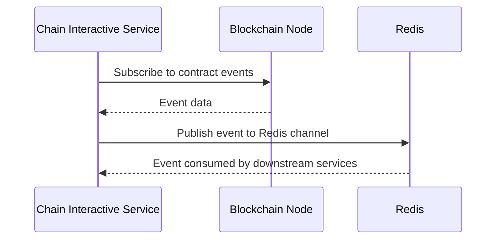

# Usage Guide (English)

This document provides detailed usage instructions for the Chain Interactive Service, including gRPC client integration, chain-specific configurations, and advanced features.

## Table of Contents

- [Service Startup](#service-startup)
- [gRPC Client Integration](#grpc-client-integration)
- [API Reference](#api-reference)
  - [CallContract](#callcontract)
  - [GetTxByTxId](#gettxbytxid)
  - [GetAvailableChainAndContractNames](#getavailablechainandcontractnames)
- [Chain-Specific Usage](#chain-specific-usage)
  - [Ethereum](#ethereum)
  - [ChainMaker](#chainmaker)
  - [Solana](#solana)
- [Event Subscription](#event-subscription)
- [TLS Configuration](#tls-configuration)
- [Monitoring](#monitoring)
- [Error Handling](#error-handling)
- [Best Practices](#best-practices)

---

## Service Startup

### Basic Startup

```bash
# Build and run with default config
make build
./chain-interactive-service -f etc/chaininteractive.yaml
```

### Version Check

```bash
./chain-interactive-service version
# Output:
# Current version: v1.1.0
# Commit hash: a1b2c3d...
# Build time: 2026-05-06 16:00:00
```

### Configuration Validation

The service automatically validates configuration on startup. If validation fails, the service will exit with an error message:

- Missing required chain configurations
- Unsupported chain types
- Missing required SDK fields (e.g., Ethereum `HttpUrl`, ChainMaker `ConfFilePath`, Solana `RpcUrl`)
- Invalid private keys
- Missing contract fields for subscription (e.g., Ethereum requires `ContractAddr`, `GetHistoryEventInterval`, `GetHistoryEventHeightWindow`)

---

## gRPC Client Integration

### Go Client Example

```go
package main

import (
    "context"
    "fmt"
    "log"
    "time"

    "google.golang.org/grpc"
    "google.golang.org/grpc/credentials/insecure"
    pb "github.com/jackz-jones/blockchain-interactive-service/pb"
)

func main() {
    // Connect to the gRPC server
    conn, err := grpc.Dial("localhost:8085", grpc.WithTransportCredentials(insecure.NewCredentials()))
    if err != nil {
        log.Fatalf("failed to connect: %v", err)
    }
    defer conn.Close()

    client := pb.NewChainInteractiveClient(conn)
    ctx, cancel := context.WithTimeout(context.Background(), 30*time.Second)
    defer cancel()

    // Example: Call a contract (Invoke)
    resp, err := client.CallContract(ctx, &pb.CallContractRequest{
        RequestId:      "req-001",
        ChainName:      "ethereum01",
        ContractName:   "notification",
        ContractMethod: "sendMessage",
        KvPairs: []*pb.KeyValuePair{
            {Key: "message", Value: []byte("Hello, Blockchain!")},
        },
        MethodType:     pb.MethodType_Invoke,
        WithSyncResult: true,
        TxTimeout:      30,
    })
    if err != nil {
        log.Fatalf("CallContract failed: %v", err)
    }
    fmt.Printf("Code: %d, TxId: %s, Pending: %v\n", resp.Code, resp.Data.TxId, resp.Data.Pending)

    // Example: Query a transaction
    txResp, err := client.GetTxByTxId(ctx, &pb.GetTxByTxIdRequest{
        RequestId: "req-002",
        TxId:      resp.Data.TxId,
        ChainName: "ethereum01",
    })
    if err != nil {
        log.Fatalf("GetTxByTxId failed: %v", err)
    }
    fmt.Printf("Code: %d, Pending: %v, Content: %s\n", txResp.Code, txResp.Data.Pending, txResp.Data.Content)

    // Example: Get available chains and contracts
    availResp, err := client.GetAvailableChainAndContractNames(ctx, &pb.GetAvailableChainAndContractNamesRequest{
        RequestId: "req-003",
    })
    if err != nil {
        log.Fatalf("GetAvailableChainAndContractNames failed: %v", err)
    }
    for _, chain := range availResp.Data {
        fmt.Printf("Chain: %s (Type: %s)\n", chain.ChainName, chain.ChainType)
        for _, contract := range chain.ContractDescs {
            fmt.Printf("  Contract: %s (Type: %s, Addr: %s)\n",
                contract.ContractName, contract.ContractType, contract.ContractAddress)
        }
    }
}
```

### Using gRPC with TLS

```go
import (
    "crypto/tls"
    "crypto/x509"
    "io/ioutil"

    "google.golang.org/grpc"
    "google.golang.org/grpc/credentials"
)

func dialWithTLS() *grpc.ClientConn {
    // Load CA cert
    caCert, _ := ioutil.ReadFile("./cert/ca/ca.pem")
    certPool := x509.NewCertPool()
    certPool.AppendCertsFromPEM(caCert)

    // Load client cert and key
    clientCert, _ := tls.LoadX509KeyPair("./cert/client/client.pem", "./cert/client/client.key")

    creds := credentials.NewTLS(&tls.Config{
        Certificates: []tls.Certificate{clientCert},
        RootCAs:      certPool,
    })

    conn, _ := grpc.Dial("localhost:8085", grpc.WithTransportCredentials(creds))
    return conn
}
```

### Using grpcurl for Testing

In dev/test mode, gRPC reflection is enabled. You can use `grpcurl` for quick testing:

```bash
# List services
grpcurl -plaintext localhost:8085 list

# Describe a service
grpcurl -plaintext localhost:8085 describe proto.ChainInteractive

# Call GetAvailableChainAndContractNames
grpcurl -plaintext -d '{"requestId":"test-001"}' localhost:8085 proto.ChainInteractive/GetAvailableChainAndContractNames

# Call CallContract (Ethereum Invoke)
grpcurl -plaintext -d '{
  "requestId": "test-002",
  "chainName": "ethereum01",
  "contractName": "notification",
  "contractMethod": "sendMessage",
  "kvPairs": [{"key": "message", "value": "SGVsbG8="}],
  "methodType": 1,
  "withSyncResult": true,
  "txTimeout": 30
}' localhost:8085 proto.ChainInteractive/CallContract

# Call GetTxByTxId
grpcurl -plaintext -d '{
  "requestId": "test-003",
  "txId": "0xabc123...",
  "chainName": "ethereum01"
}' localhost:8085 proto.ChainInteractive/GetTxByTxId
```

---

## API Reference

### CallContract

Invokes or queries a smart contract on the specified chain.

**Request: `CallContractRequest`**

| Field | Type | Required | Description |
|---|---|---|---|
| requestId | string | No | Request ID for log tracing |
| chainName | string | Yes | Chain configuration name (e.g., `ethereum01`) |
| contractName | string | Yes | Contract configuration name (e.g., `notification`) |
| contractMethod | string | Yes | Contract method to call |
| kvPairs | KeyValuePair[] | No | Method parameters as key-value pairs |
| methodType | MethodType | Yes | `1` = Invoke (write), `2` = Query (read) |
| withSyncResult | bool | No | Wait for on-chain confirmation (default: false) |
| txTimeout | int64 | No | Timeout in seconds (default: 30) |

**Response: `TxResponse`**

| Field | Type | Description |
|---|---|---|
| code | int32 | Response code (200000 = success) |
| msg | string | Error message (if any) |
| data | TxData | Transaction data |

**`TxData` fields:**

| Field | Type | Description |
|---|---|---|
| chainName | string | Chain configuration name |
| content | string | Transaction result (JSON string) |
| pending | bool | `true` = not yet confirmed, `false` = confirmed on-chain |
| txId | string | Transaction hash/ID |

**Behavior details:**

- **Invoke with `withSyncResult=true`**: The service waits for the transaction to be confirmed on-chain, then returns `pending=false`.
- **Invoke with `withSyncResult=false`**: The service returns immediately after submitting the transaction, with `pending=true`.
- **Query (methodType=2)**: Reads contract state without creating a transaction. The `txId` may be empty.
- **Ethereum timeout**: If synchronous receipt retrieval times out, the transaction was still submitted. The response includes the `txId` with an error message.

### GetTxByTxId

Queries transaction details and on-chain status by transaction ID.

**Request: `GetTxByTxIdRequest`**

| Field | Type | Required | Description |
|---|---|---|---|
| requestId | string | No | Request ID for log tracing |
| txId | string | Yes | Transaction hash/ID |
| chainName | string | Yes | Chain configuration name |

**Response: `TxResponse`** (same as CallContract)

The `pending` field indicates whether the transaction has been confirmed:
- `true`: Transaction is pending (not yet in a block)
- `false`: Transaction has been confirmed

### GetAvailableChainAndContractNames

Returns all enabled chains and their contract configurations.

**Request: `GetAvailableChainAndContractNamesRequest`**

| Field | Type | Required | Description |
|---|---|---|---|
| requestId | string | No | Request ID for log tracing |

**Response: `GetAvailableChainAndContractNamesResponse`**

| Field | Type | Description |
|---|---|---|
| code | int32 | Response code |
| msg | string | Message |
| data | ChainAndContractName[] | List of chains and contracts |

**`ChainAndContractName` fields:**

| Field | Type | Description |
|---|---|---|
| chainName | string | Chain configuration name |
| chainType | ChainType | Chain type enum (0=Ethereum, 1=Chainmaker, 2=Solana) |
| contractDescs | ContractDesc[] | List of contract descriptions |

**`ContractDesc` fields:**

| Field | Type | Description |
|---|---|---|
| contractName | string | Contract configuration name |
| contractType | ContractType | Contract type enum (0=Notification, 1=Nft) |
| contractAddress | string | Contract address (Ethereum/Solana) |
| abi | string | Contract ABI JSON (Ethereum only) |

---

## Chain-Specific Usage

### Ethereum

**Configuration:**

```yaml
ChainConfs:
  ethereum01:
    Enable: true
    ChainType: "ethereum"
    SdkConf:
      EthConf:
        ChainId: 1                                    # Chain ID (1=Mainnet, 5=Goerli, etc.)
        HttpUrl: "https://mainnet.infura.io/v3/KEY"   # HTTP RPC endpoint
        WebsocketUrl: "wss://mainnet.infura.io/ws/v3/KEY"  # WebSocket endpoint (for events)
        PrivateKey: "hex-private-key"                  # Signer private key (hex)
        GasLimit: 1000000                              # Gas limit for transactions
```

**CallContract behavior:**

- **Invoke**: Sends a signed transaction via HTTP RPC. If `withSyncResult=true`, polls for the transaction receipt.
- **Query**: Calls the contract's read-only method via `eth_call`.
- **Parameters**: `kvPairs` are mapped to the contract method's input parameters by name (using the ABI file).

**Contract subscription configuration:**

```yaml
ContractConfs:
  notification:
    EnableSubscribe: true
    ContractType: "notification"
    ContractAddr: "0x..."                    # Contract address
    Abi: ./etc/notification.json             # ABI JSON file path
    DeployBlockHeight: 0                     # Block height at deployment
    GetHistoryEventInterval: 500             # Polling interval in ms
    GetHistoryEventHeightWindow: 100         # Blocks per poll batch
```

**Event subscription mechanism:**

The Ethereum client uses a polling strategy to subscribe to events:
1. On startup, it fetches historical events from `DeployBlockHeight` to the current block height in batches.
2. After catching up, it switches to WebSocket-based real-time event subscription.
3. If the WebSocket connection drops, it automatically reconnects and resumes from the last processed block.
4. Events are published to Redis for downstream consumers.

### ChainMaker

**Configuration:**

```yaml
ChainConfs:
  chainmaker01:
    Enable: true
    ChainType: "chainmaker"
    SdkConf:
      ConfFilePath: ./etc/chainmaker_sdk_config.yml   # ChainMaker SDK config file
```

The `chainmaker_sdk_config.yml` file contains chain node addresses, user certificates, and other chain-specific settings required by the ChainMaker SDK.

**CallContract behavior:**

- **Invoke**: Sends a transaction to the chain node and optionally waits for confirmation.
- **Query**: Reads contract state without creating a transaction.
- **Parameters**: `kvPairs` are passed as key-value pairs to the ChainMaker SDK.

**Contract subscription configuration:**

```yaml
ContractConfs:
  notification:
    EnableSubscribe: true
    ContractType: "notification"
    ContractName: "notificationv100"   # On-chain contract name
    DeployBlockHeight: 5               # Block height at deployment
```

**Event subscription mechanism:**

ChainMaker uses the SDK's built-in event subscription API. Events are pushed from the chain node to the service and published to Redis.

### Solana

**Configuration:**

```yaml
ChainConfs:
  solana01:
    Enable: true
    ChainType: "solana"
    SdkConf:
      SolanaConf:
        RpcUrl: "https://api.mainnet-beta.solana.com"  # RPC endpoint
        PrivateKey: "base58-private-key"                 # Signer private key (base58)
        CommitmentLevel: "confirmed"                      # processed / confirmed / finalized
        SkipPreflight: false                              # Skip preflight check
        MaxRetries: 3                                     # Transaction retry count
```

**CallContract behavior:**

- **Invoke**: Constructs a Solana transaction with the specified instruction, signs it, and sends it to the RPC node.
  - The instruction data is built using Borsh serialization based on the `SolanaMethods` configuration.
  - Account metas are resolved from the `Accounts` configuration (supports `$fromAddress` placeholder).
  - If `withSyncResult=true`, the service waits for transaction confirmation.
- **Query**: Uses `getMultipleAccounts` RPC to read account data, then decodes it based on the method's `Discriminator`.

**Solana Method Specification (`SolanaMethods`):**

This is a key configuration that defines how to encode/decode Solana contract calls:

```yaml
SolanaMethods:
  # Method name (matches the contractMethod in CallContract request)
  notify:
    # 8-byte Anchor discriminator (hex string, 16 hex characters)
    Discriminator: "e445a52e51cb9a1d"
    # Parameter schema for Borsh serialization
    ArgSchema:
      - Name: "msg"           # Must match KeyValuePair.Key in the request
        Type: "string"        # Type: u8, u16, u32, u64, i64, bool, string, pubkey, bytes
      - Name: "amount"
        Type: "u64"
    # Account list for Invoke calls
    Accounts:
      - Pubkey: "$fromAddress"  # Placeholder for the signer's address
        IsSigner: true
        IsWritable: true
      - Pubkey: "SomeAccount1111111111111111111111111"
        IsSigner: false
        IsWritable: false

  # Query method using getMultipleAccounts
  getState:
    Discriminator: "0000000000000000"
    # Account addresses to read (supports "$fromAddress" placeholder)
    QueryAccounts:
      - "$fromAddress"
      - "DataAccount1111111111111111111111111111"
```

**Supported ArgSchema types:**

| Type | Size | Description |
|---|---|---|
| u8 | 1 byte | Unsigned 8-bit integer |
| u16 | 2 bytes | Unsigned 16-bit integer |
| u32 | 4 bytes | Unsigned 32-bit integer |
| u64 | 8 bytes | Unsigned 64-bit integer |
| i64 | 8 bytes | Signed 64-bit integer |
| bool | 1 byte | Boolean (0 or 1) |
| string | 4+N bytes | Borsh string (length prefix + UTF-8 data) |
| pubkey | 32 bytes | Solana public key (base58 input) |
| bytes | variable | Raw bytes (base64 input) |

**Contract subscription configuration:**

```yaml
ContractConfs:
  notification:
    EnableSubscribe: true
    ContractType: "notification"
    ContractAddr: "program-id-base58"   # Solana program ID (base58)
    DeployBlockHeight: 0                 # Slot number at deployment
```

**Event subscription mechanism:**

Solana uses WebSocket-based log subscription (`logsSubscribe`) to monitor program events. Events are parsed and published to Redis.

---

## Event Subscription

### Overview

The event subscription system allows you to receive real-time notifications when contract events occur on-chain.

### Architecture



### How It Works

1. On service startup, the `StartSubscribe` function is called, which launches a scheduling goroutine.
2. The scheduler checks every 3 seconds for chains/contracts that need subscription.
3. For each enabled subscription (`EnableSubscribe: true`), a subscription goroutine is started.
4. If a subscription goroutine exits (error or disconnect), the `SubscribeFlag` is cleared, and the next scheduler tick will re-subscribe.
5. On service shutdown, the root context is cancelled, which propagates to all subscription goroutines.

### Redis Event Format

Subscribed events are published to Redis. The specific channel and format depend on the `contractType` and `chainType` configuration.

### Redis Deployment Modes

The service supports three Redis deployment modes:

| Mode | ConfType | Description |
|---|---|---|
| Single Node | `node` | Single Redis instance |
| Cluster | `cluster` | Redis Cluster with multiple nodes |
| Sentinel | `sentinel` | Redis Sentinel for high availability |

```yaml
SubscribeConf:
  ConfType: sentinel
  RedisAddr: "sentinel1:26379,sentinel2:26379,sentinel3:26379"
  RedisUserName: ""
  RedisPassword: "your-password"
  MasterName: "mymaster"    # Required for sentinel mode
```

---

## TLS Configuration

### Enable TLS for gRPC

1. Generate certificates:

```bash
make gen-cert
# Certificates will be generated in ./cert/ directory
```

2. Configure the service:

```yaml
GrpcConf:
  CaCertFile: ./cert/ca/ca.pem
  ServerCertFile: ./cert/chain-service/server.pem
  ServerKeyFile: ./cert/chain-service/server.key
```

3. On the client side, load the CA cert and client cert/key for mutual TLS.

### Disable TLS

Leave the cert paths empty to disable TLS:

```yaml
GrpcConf:
  CaCertFile: ""
  ServerCertFile: ""
  ServerKeyFile: ""
```

---

## Monitoring

### Health Check

The service provides a health check endpoint:

```bash
curl http://localhost:6061/healthz
# Response: OK
```

### Prometheus Metrics

Prometheus metrics are available at:

```bash
curl http://localhost:6061/metrics
```

### OpenTelemetry Tracing

Configure tracing in the service config:

```yaml
Telemetry:
  Disabled: false
  Name: chain.rpc
  Endpoint: http://jaeger:14268/api/traces
  Sampler: 1.0
  Batcher: jaeger  # jaeger / zipkin / otlpgrpc / otlphttp
```

### DevServer Configuration

```yaml
DevServer:
  Enable: true
  Port: 6061
  HealthPath: "/healthz"
  HealthResponse: "OK"
  MetricsPath: "/metrics"
```

---

## Error Handling

### Response Code Pattern

- `200000`: Success
- `600xxx`: Service-level errors

| Code | Constant | Description |
|---|---|---|
| 200000 | Success | Operation succeeded |
| 600000 | ErrUnknownContractType | The `ContractType` in config is not recognized |
| 600001 | ErrUnknownChainType | The `ChainType` in config is not recognized |
| 600002 | ErrGetSDKClient | Failed to create or retrieve SDK client |
| 600003 | ErrGetTxByTxId | Failed to query transaction by ID |
| 600004 | ErrSendTransaction | Failed to send transaction to the chain |
| 600005 | ErrReadAbiJsonFile | Failed to read the ABI JSON file (Ethereum) |
| 600006 | ErrChainNotExist | The specified `chainName` does not exist in config |
| 600007 | ErrChainNotEnable | The specified chain exists but is not enabled |

### Ethereum Transaction Timeout

When calling `CallContract` with `withSyncResult=true` on Ethereum, if the receipt is not available within the timeout, the service returns error code `600004` with the message:

```
sync to get tx receipt timeout, maybe try it later
```

In this case, the transaction **was successfully submitted** to the node. The `txId` is included in the response data, and you can query the transaction status later using `GetTxByTxId`.

---

## Best Practices

### Configuration

1. **Start with disabled chains**: Set `Enable: false` for chains you're not actively using to avoid unnecessary SDK client initialization.
2. **Set appropriate timeouts**: Use `txTimeout` based on your chain's typical confirmation time.
3. **Use environment-specific configs**: Maintain separate configuration files for dev/test/pre/prod environments.

### Performance

1. **Use async mode for high throughput**: Set `withSyncResult=false` when you don't need immediate confirmation, then poll `GetTxByTxId` separately.
2. **Tune Ethereum event polling**: Adjust `GetHistoryEventInterval` and `GetHistoryEventHeightWindow` based on your chain's block production rate.
3. **Use Redis cluster for production**: For high-availability event subscription, use Redis cluster or sentinel mode.

### Reliability

1. **Enable subscription auto-recovery**: The service automatically re-subscribes when subscription goroutines exit. No manual intervention is needed.
2. **Monitor health checks**: Set up monitoring on the `/healthz` endpoint to detect service issues.
3. **Use TLS in production**: Always enable TLS for gRPC communication in production environments.

### Development

1. **Use gRPC reflection in dev mode**: The service enables gRPC reflection in dev/test mode, allowing tools like `grpcurl` to discover services.
2. **Run tests before committing**: Use `make pre-commit` to run lint, tests, and comment coverage checks.
3. **Version your builds**: The build system injects version, commit hash, and build time into the binary.

---

## Multi-Tenant HTTP API

The service provides a RESTful HTTP API Gateway (default port: 8080) for multi-tenant management and contract operations.

### Authentication

All HTTP API requests require an `X-API-Key` header:

```bash
curl -H "X-API-Key: your-api-key" http://localhost:8080/api/v1/chains
```

### Tenant Management

```bash
# Create tenant
curl -X POST http://localhost:8080/api/v1/tenants \
  -H "Content-Type: application/json" \
  -H "X-API-Key: admin-api-key" \
  -d '{"name": "my-company", "email": "admin@company.com", "plan": "developer"}'

# List tenants
curl -H "X-API-Key: admin-api-key" http://localhost:8080/api/v1/tenants

# Disable tenant
curl -X POST http://localhost:8080/api/v1/tenants/1/disable \
  -H "X-API-Key: admin-api-key"

# Enable tenant
curl -X POST http://localhost:8080/api/v1/tenants/1/enable \
  -H "X-API-Key: admin-api-key"
```

### API Key Management

```bash
# Create API Key
curl -X POST http://localhost:8080/api/v1/api-keys \
  -H "Content-Type: application/json" \
  -H "X-API-Key: admin-api-key" \
  -d '{"name": "production-key", "permissions": ["contract:call", "tx:query"]}'

# List API Keys
curl -H "X-API-Key: admin-api-key" http://localhost:8080/api/v1/api-keys
```

### Chain Configuration Management

```bash
# Create chain config
curl -X POST http://localhost:8080/api/v1/chain-configs \
  -H "Content-Type: application/json" \
  -H "X-API-Key: admin-api-key" \
  -d '{
    "chain_name": "eth-mainnet",
    "chain_type": "ethereum",
    "sdk_conf": "{\"chain_id\":1,\"http_url\":\"https://mainnet.infura.io/v3/KEY\"}"
  }'

# List chain configs
curl -H "X-API-Key: admin-api-key" http://localhost:8080/api/v1/chain-configs

# Update chain config
curl -X PUT http://localhost:8080/api/v1/chain-configs/1 \
  -H "Content-Type: application/json" \
  -H "X-API-Key: admin-api-key" \
  -d '{"enable": false}'

# Delete chain config
curl -X DELETE http://localhost:8080/api/v1/chain-configs/1 \
  -H "X-API-Key: admin-api-key"
```

### Contract Operations via HTTP

```bash
# Call contract
curl -X POST http://localhost:8080/api/v1/contract/call \
  -H "Content-Type: application/json" \
  -H "X-API-Key: your-api-key" \
  -d '{
    "chain_name": "ethereum01",
    "contract_name": "notification",
    "contract_method": "sendMessage",
    "kv_pairs": [{"key": "message", "value": "SGVsbG8="}],
    "method_type": 1,
    "with_sync_result": true,
    "tx_timeout": 30
  }'

# Query transaction
curl -H "X-API-Key: your-api-key" \
  http://localhost:8080/api/v1/transaction/0xabc123...?chain_name=ethereum01
```

### Dashboard API

```bash
# Get dashboard overview
curl -H "X-API-Key: admin-api-key" http://localhost:8080/api/v1/dashboard/overview

# Query call logs (with filters)
curl -H "X-API-Key: admin-api-key" \
  "http://localhost:8080/api/v1/dashboard/call-logs?page=1&page_size=20&chain_name=ethereum01&status=success"

# Get usage statistics
curl -H "X-API-Key: admin-api-key" http://localhost:8080/api/v1/dashboard/usage-stats

# Query bills
curl -H "X-API-Key: admin-api-key" \
  "http://localhost:8080/api/v1/dashboard/bills?page=1&page_size=10"

# Query audit logs
curl -H "X-API-Key: admin-api-key" \
  "http://localhost:8080/api/v1/dashboard/audit-logs?page=1&page_size=20&action=CallContract"
```

---

## Related Documentation

- **[Architecture Document (EN)](architecture_en.md)** — System architecture, module design, deployment diagrams
- **[Architecture Document (CN)](architecture_cn.md)** — 系统架构、模块设计、部署架构图
