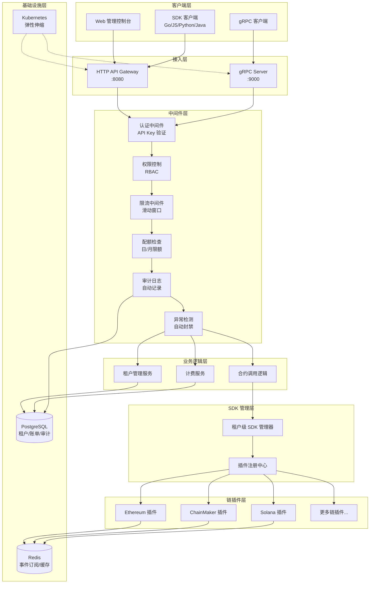
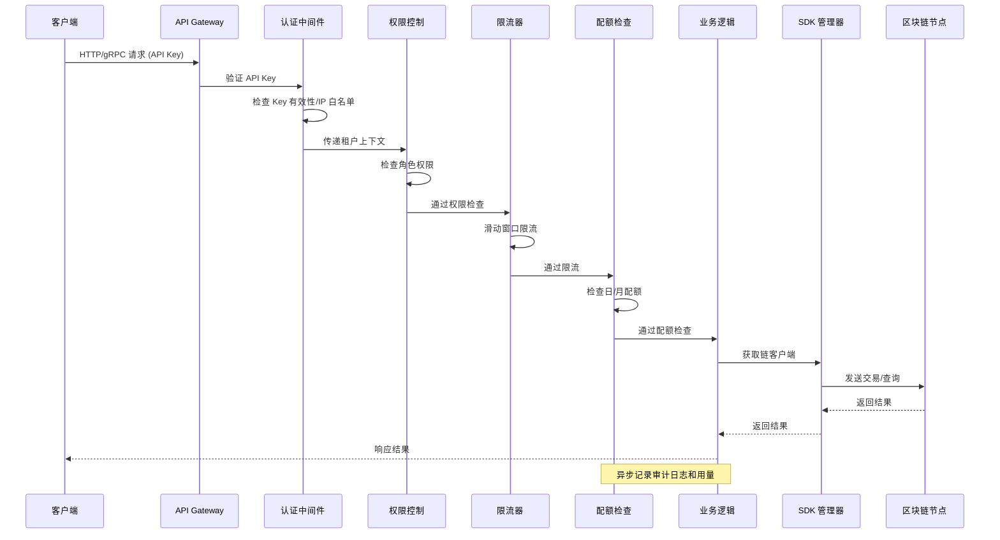
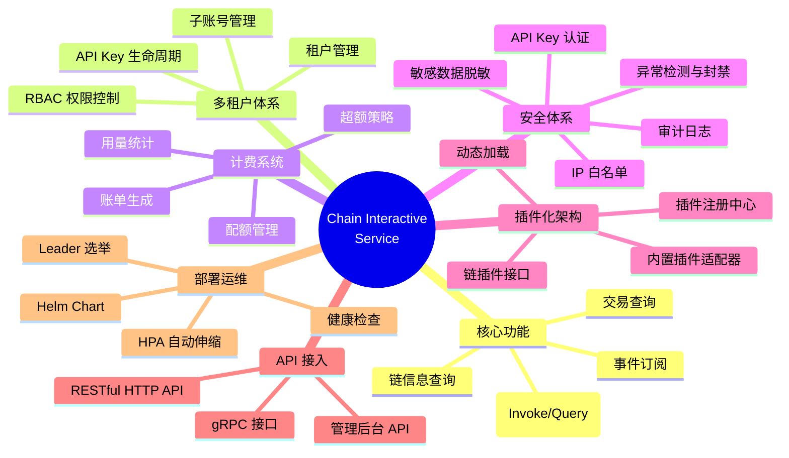
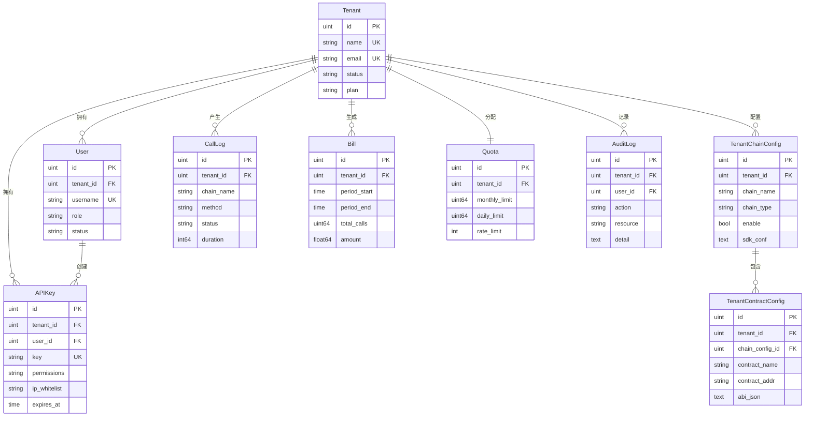
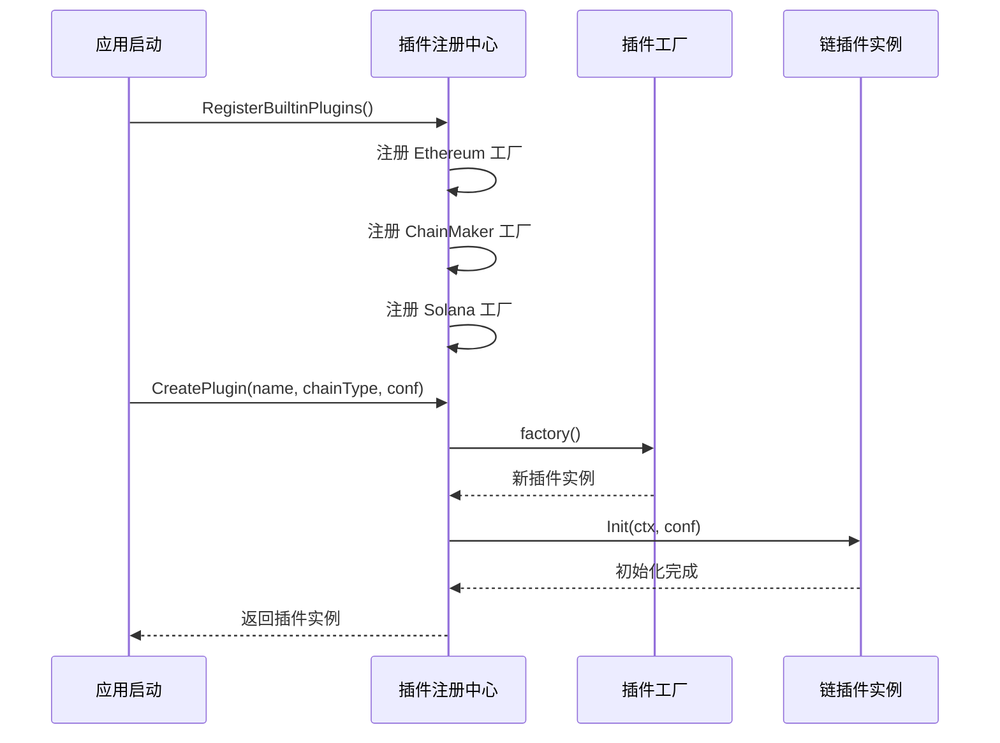
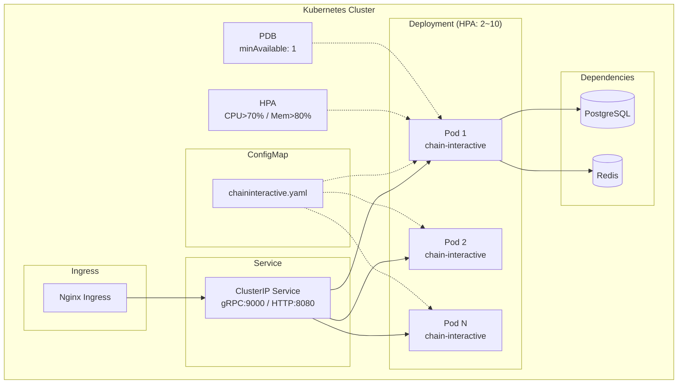
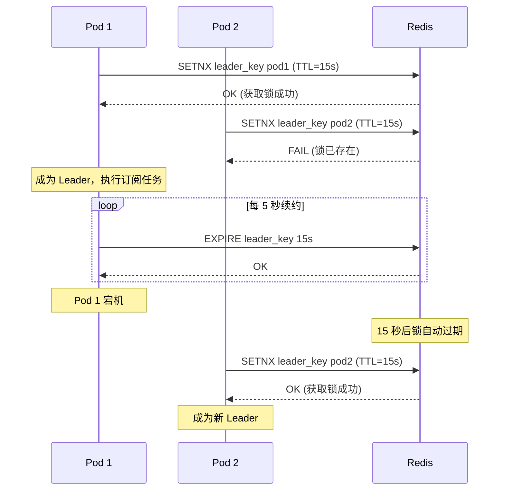
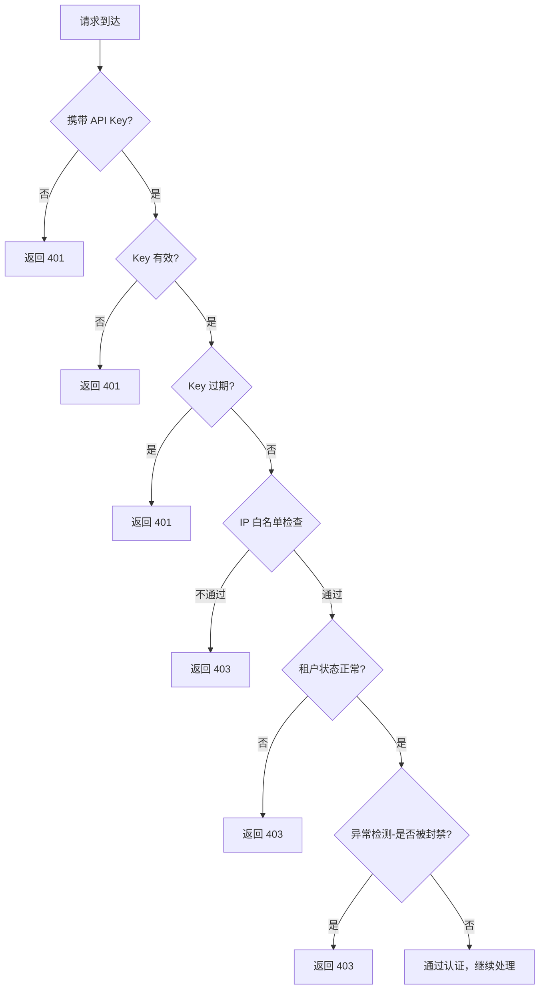

# Chain Interactive Service 架构说明文档

**[English](architecture_en.md)** | **中文**

---

## 1. 项目概述

Chain Interactive Service 是一个通用区块链交互服务平台（BaaS - Blockchain as a Service），提供统一的 gRPC 和 RESTful API 接口与多种区块链（Ethereum、ChainMaker、Solana）进行交互，屏蔽底层链差异，使上层业务无需关心链的具体实现细节。

项目已从单纯的区块链中间件演进为支持**多租户**、**计费配额**、**插件化架构**、**安全审计**的商业化 BaaS 平台。

---

## 2. 系统架构

### 2.1 整体架构图



### 2.2 请求处理流程



---

## 3. 功能架构

### 3.1 功能模块总览



### 3.2 核心功能模块

| 模块 | 描述 | 关键文件 |
|------|------|----------|
| **合约调用** | 统一接口调用多链合约（Invoke/Query） | `internal/logic/callcontractlogic.go` |
| **交易查询** | 根据交易 ID 查询交易状态和详情 | `internal/logic/gettxbytxidlogic.go` |
| **事件订阅** | 订阅链上合约事件，推送到 Redis | `internal/sdk/*.go` |
| **链信息查询** | 查询可用链和合约配置 | `internal/logic/getavailablechainandcontractnameslogic.go` |

### 3.3 商业化功能模块

| 模块 | 描述 | 关键文件 |
|------|------|----------|
| **多租户管理** | 租户创建/禁用/启用、子账号、API Key 管理 | `internal/tenant/service.go` |
| **认证鉴权** | API Key 认证 + RBAC 权限控制 | `internal/middleware/auth.go`, `rbac.go` |
| **计费配额** | 配额检查、用量记录、账单生成 | `internal/billing/service.go` |
| **限流** | 基于滑动窗口的 QPS 限流 | `internal/middleware/ratelimit.go` |
| **审计日志** | 自动记录所有操作的审计日志 | `internal/middleware/audit.go` |
| **异常检测** | 失败频率监控、自动封禁 | `internal/middleware/anomaly.go` |
| **管理后台 API** | 仪表盘、日志查询、账单查询 | `internal/gateway/admin_handlers.go` |

---

## 4. 目录结构

```
chain-interactive-service/
├── chaininteractive.go              # 服务主入口
├── chaininteractive/                # goctl 生成的业务逻辑层
├── internal/
│   ├── config/
│   │   └── config.go               # 配置定义与校验
│   ├── logic/                       # gRPC 业务逻辑
│   │   ├── callcontractlogic.go     # 合约调用逻辑
│   │   ├── gettxbytxidlogic.go      # 交易查询逻辑
│   │   └── getavailablechainandcontractnameslogic.go
│   ├── sdk/                         # 链 SDK 客户端
│   │   ├── interface.go             # 统一链接口定义
│   │   ├── helper.go               # SDK 客户端管理与订阅调度
│   │   ├── ethereumclient.go       # 以太坊客户端实现
│   │   ├── chainmakerclient.go     # 长安链客户端实现
│   │   ├── solanaclient.go         # Solana 客户端实现
│   │   ├── solana_codec.go         # Solana Borsh 编解码
│   │   └── tenant_sdk_manager.go   # 租户级 SDK 管理器
│   ├── store/                       # 数据持久化层
│   │   ├── model.go                # 数据模型定义
│   │   ├── db.go                   # 数据库连接
│   │   └── repository.go          # Repository 接口与实现
│   ├── gateway/                     # HTTP API Gateway
│   │   ├── server.go              # Gateway 服务启动
│   │   ├── routes.go              # 路由注册
│   │   ├── handlers.go            # 核心 API Handler
│   │   └── admin_handlers.go      # 管理后台 API Handler
│   ├── middleware/                  # 中间件
│   │   ├── auth.go                # gRPC 认证拦截器
│   │   ├── http_auth.go           # HTTP 认证中间件
│   │   ├── rbac.go                # RBAC 权限控制
│   │   ├── ratelimit.go           # 限流中间件
│   │   ├── quota.go               # 配额检查中间件
│   │   ├── audit.go               # 审计日志中间件
│   │   └── anomaly.go             # 异常检测与封禁
│   ├── billing/                     # 计费系统
│   │   └── service.go             # 计费服务实现
│   ├── tenant/                      # 租户管理
│   │   └── service.go             # 租户服务实现
│   ├── plugin/                      # 插件化架构
│   │   ├── registry.go            # 插件注册中心
│   │   └── builtin.go             # 内置链插件适配器
│   ├── deploy/                      # 部署相关
│   │   └── leader_election.go     # 分布式 Leader 选举
│   ├── server/                      # gRPC 服务注册
│   ├── svc/                         # 服务上下文
│   │   └── servicecontext.go      # ServiceContext 依赖注入
│   └── code/                        # 响应码定义
├── proto/                           # Protobuf 定义
│   └── chaininteractive.proto
├── pb/                              # 生成的 Protobuf Go 代码
├── deploy/                          # 部署配置
│   └── helm/                       # Helm Chart
│       ├── Chart.yaml
│       ├── values.yaml
│       └── templates/
├── docker/                          # Docker 构建
├── etc/                             # 配置文件
├── scripts/                         # 脚本工具
└── doc/                             # 文档
```

---

## 5. 数据模型

### 5.1 ER 关系图



---

## 6. 插件化架构

### 6.1 插件接口

所有链实现都必须实现 `ChainPlugin` 接口：

```go
type ChainPlugin interface {
    Name() string                    // 插件名称
    ChainType() string               // 链类型
    Version() string                 // 插件版本
    Init(ctx, conf) error            // 初始化
    HealthCheck(ctx) error           // 健康检查
    CallContract(...)                // 调用合约
    GetTxByTxId(txId) (...)          // 查询交易
    SubscribeContractEvent(...)      // 订阅事件
    Stop() error                     // 停止释放资源
}
```

### 6.2 插件注册流程



---

## 7. 部署架构

### 7.1 Kubernetes 部署



### 7.2 Leader 选举

多实例环境下，事件订阅任务通过 Redis 分布式锁实现 Leader 选举，确保每个订阅任务只有一个实例执行：



---

## 8. 安全架构

### 8.1 安全防护层次

| 层次 | 机制 | 说明 |
|------|------|------|
| **接入层** | API Key 认证 | 每个请求必须携带有效的 API Key |
| **网络层** | IP 白名单 | 可限制 API Key 只能从指定 IP 访问 |
| **权限层** | RBAC | 基于角色的访问控制（admin/developer/readonly） |
| **流量层** | 限流 + 配额 | 防止滥用，保护系统稳定性 |
| **检测层** | 异常检测 | 短时间大量失败请求自动封禁 |
| **审计层** | 审计日志 | 所有操作自动记录，支持事后追溯 |
| **数据层** | 敏感数据脱敏 | 日志中自动 mask 私钥、密码等敏感字段 |

### 8.2 认证流程



---

## 9. 技术栈

| 类别 | 技术 | 版本 |
|------|------|------|
| **语言** | Go | 1.22+ |
| **框架** | go-zero | v1.6.2 |
| **通信** | gRPC + Protobuf | - |
| **HTTP** | go-zero/rest | - |
| **数据库** | PostgreSQL / MySQL | - |
| **ORM** | GORM | v1.25+ |
| **缓存** | Redis | - |
| **链 SDK** | go-ethereum | v1.14.11 |
| **链 SDK** | chainmaker-sdk-go | v2.3.8 |
| **链 SDK** | solana-go | v1.8.3 |
| **监控** | Prometheus + OpenTelemetry | - |
| **部署** | Kubernetes + Helm | - |
| **容器** | Docker | - |

---

## 10. API 接口总览

### 10.1 gRPC 接口

| 方法 | 描述 |
|------|------|
| `CallContract` | 调用/查询链上合约 |
| `GetTxByTxId` | 根据交易 ID 查询交易 |
| `GetAvailableChainAndContractNames` | 获取可用链和合约列表 |

### 10.2 RESTful HTTP API

| 方法 | 路径 | 描述 |
|------|------|------|
| POST | `/api/v1/contract/call` | 调用合约 |
| GET | `/api/v1/transaction/:txId` | 查询交易 |
| GET | `/api/v1/chains` | 获取可用链列表 |
| POST | `/api/v1/tenants` | 创建租户 |
| GET | `/api/v1/tenants` | 租户列表 |
| POST | `/api/v1/tenants/:id/disable` | 禁用租户 |
| POST | `/api/v1/tenants/:id/enable` | 启用租户 |
| POST | `/api/v1/api-keys` | 创建 API Key |
| GET | `/api/v1/api-keys` | API Key 列表 |
| POST | `/api/v1/chain-configs` | 创建链配置 |
| GET | `/api/v1/chain-configs` | 链配置列表 |
| PUT | `/api/v1/chain-configs/:id` | 更新链配置 |
| DELETE | `/api/v1/chain-configs/:id` | 删除链配置 |
| GET | `/api/v1/users` | 用户列表 |
| GET | `/api/v1/dashboard/overview` | 仪表盘概览 |
| GET | `/api/v1/dashboard/call-logs` | 调用日志 |
| GET | `/api/v1/dashboard/usage-stats` | 用量统计 |
| GET | `/api/v1/dashboard/bills` | 账单列表 |
| GET | `/api/v1/dashboard/audit-logs` | 审计日志 |
