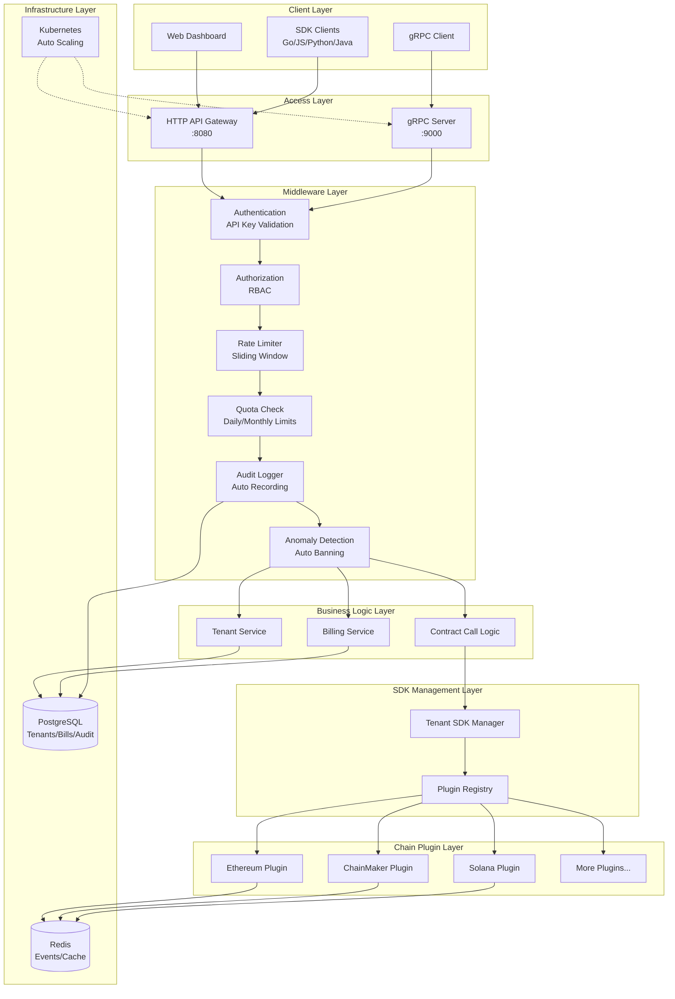
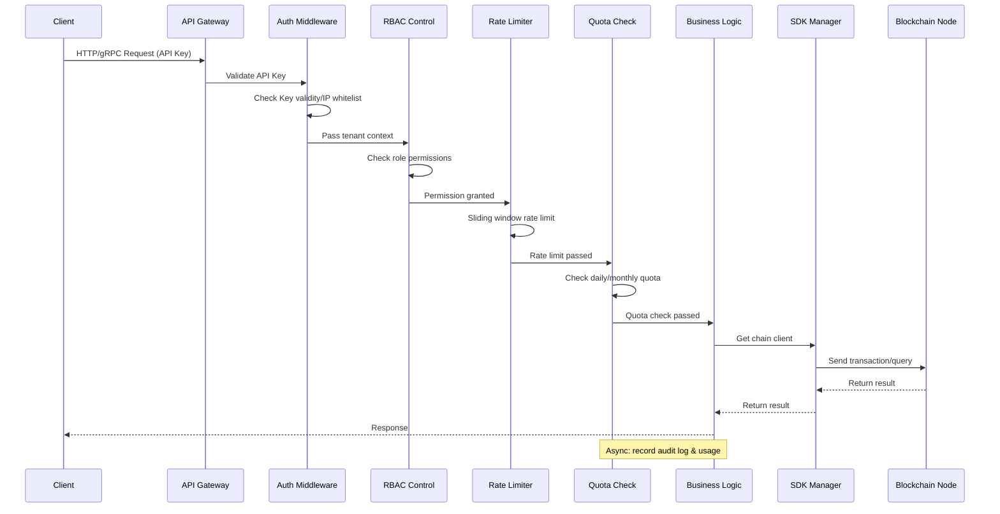
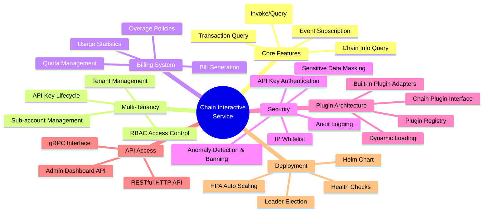
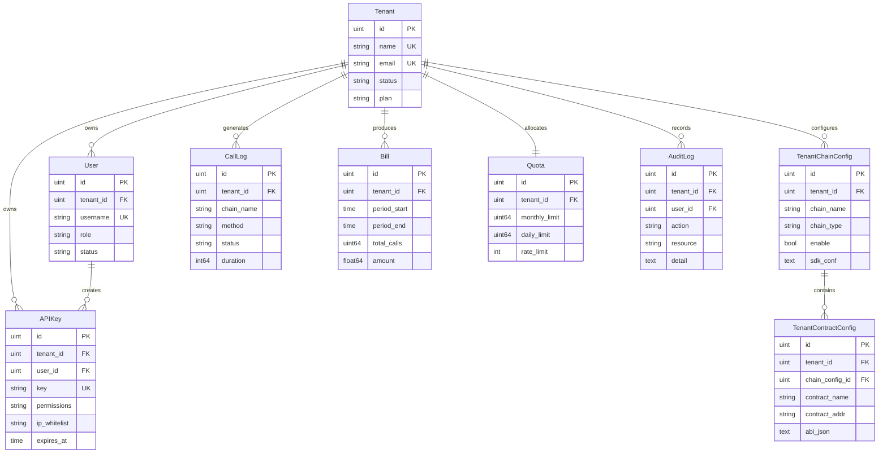
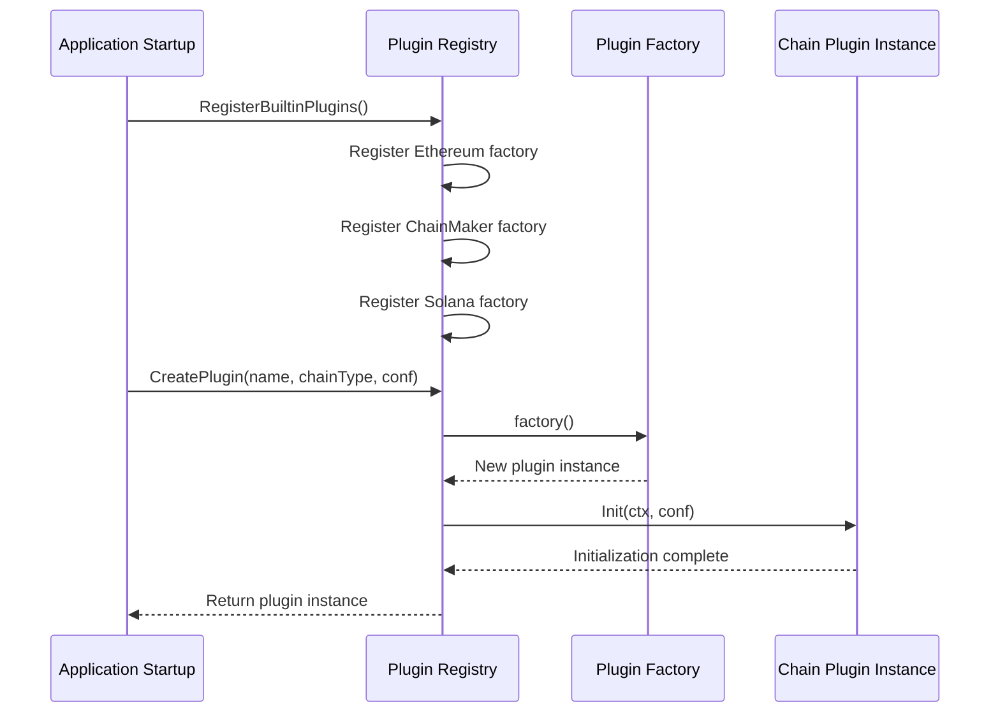
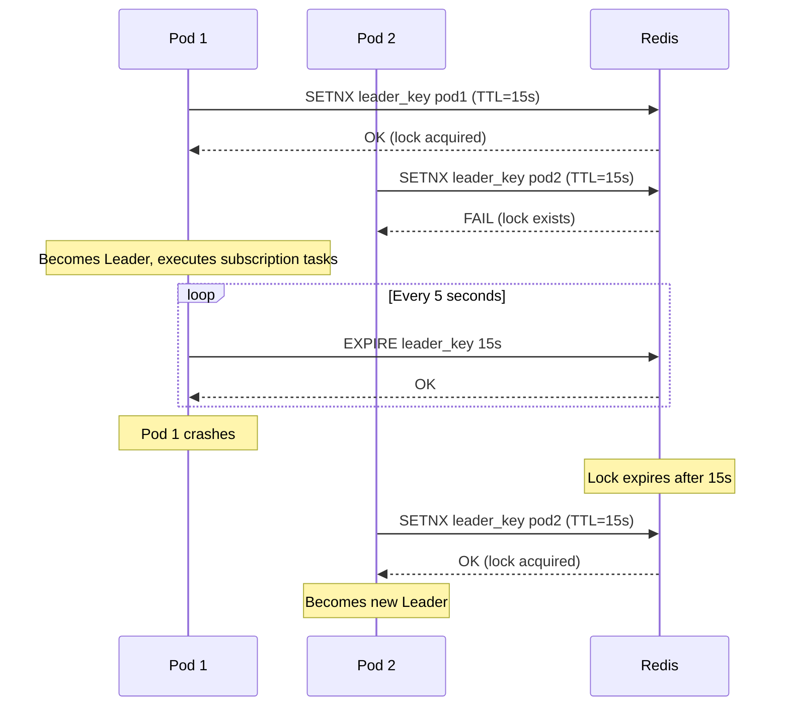
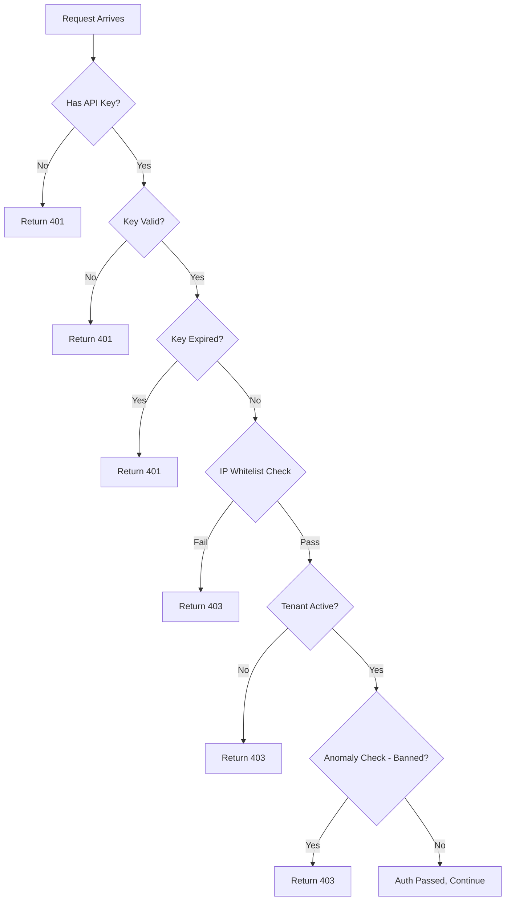

# Chain Interactive Service Architecture Document

**English** | **[中文](architecture_cn.md)**

---

## 1. Project Overview

Chain Interactive Service is a universal blockchain interaction platform (BaaS - Blockchain as a Service) that provides unified gRPC and RESTful API interfaces to interact with multiple blockchains (Ethereum, ChainMaker, Solana), abstracting away underlying chain differences so that upper-layer services don't need to care about chain-specific implementation details.

The project has evolved from a simple blockchain middleware into a commercial BaaS platform supporting **multi-tenancy**, **billing & quotas**, **plugin architecture**, and **security auditing**.

---

## 2. System Architecture

### 2.1 Overall Architecture Diagram



### 2.2 Request Processing Flow



---

## 3. Functional Architecture

### 3.1 Module Overview



### 3.2 Core Function Modules

| Module | Description | Key Files |
|--------|-------------|-----------|
| **Contract Call** | Unified interface for multi-chain contract calls (Invoke/Query) | `internal/logic/callcontractlogic.go` |
| **Transaction Query** | Query transaction status and details by TX ID | `internal/logic/gettxbytxidlogic.go` |
| **Event Subscription** | Subscribe to on-chain contract events, push to Redis | `internal/sdk/*.go` |
| **Chain Info Query** | Query available chains and contract configurations | `internal/logic/getavailablechainandcontractnameslogic.go` |

### 3.3 Commercial Feature Modules

| Module | Description | Key Files |
|--------|-------------|-----------|
| **Multi-Tenant Management** | Tenant CRUD, sub-accounts, API Key management | `internal/tenant/service.go` |
| **Authentication** | API Key auth + RBAC access control | `internal/middleware/auth.go`, `rbac.go` |
| **Billing & Quota** | Quota check, usage recording, bill generation | `internal/billing/service.go` |
| **Rate Limiting** | Sliding window QPS rate limiting | `internal/middleware/ratelimit.go` |
| **Audit Logging** | Automatic audit log recording for all operations | `internal/middleware/audit.go` |
| **Anomaly Detection** | Failure rate monitoring, auto-banning | `internal/middleware/anomaly.go` |
| **Admin Dashboard API** | Dashboard overview, log queries, billing queries | `internal/gateway/admin_handlers.go` |

---

## 4. Directory Structure

```
chain-interactive-service/
├── chaininteractive.go              # Service entry point
├── chaininteractive/                # goctl generated business logic
├── internal/
│   ├── config/
│   │   └── config.go               # Configuration definitions & validation
│   ├── logic/                       # gRPC business logic
│   │   ├── callcontractlogic.go     # Contract call logic
│   │   ├── gettxbytxidlogic.go      # Transaction query logic
│   │   └── getavailablechainandcontractnameslogic.go
│   ├── sdk/                         # Chain SDK clients
│   │   ├── interface.go             # Unified chain interface
│   │   ├── helper.go               # SDK client management & subscription scheduling
│   │   ├── ethereumclient.go       # Ethereum client implementation
│   │   ├── chainmakerclient.go     # ChainMaker client implementation
│   │   ├── solanaclient.go         # Solana client implementation
│   │   ├── solana_codec.go         # Solana Borsh codec
│   │   └── tenant_sdk_manager.go   # Tenant-level SDK manager
│   ├── store/                       # Data persistence layer
│   │   ├── model.go                # Data model definitions
│   │   ├── db.go                   # Database connection
│   │   └── repository.go          # Repository interface & implementation
│   ├── gateway/                     # HTTP API Gateway
│   │   ├── server.go              # Gateway server startup
│   │   ├── routes.go              # Route registration
│   │   ├── handlers.go            # Core API handlers
│   │   └── admin_handlers.go      # Admin dashboard API handlers
│   ├── middleware/                  # Middleware
│   │   ├── auth.go                # gRPC auth interceptor
│   │   ├── http_auth.go           # HTTP auth middleware
│   │   ├── rbac.go                # RBAC access control
│   │   ├── ratelimit.go           # Rate limiting middleware
│   │   ├── quota.go               # Quota check middleware
│   │   ├── audit.go               # Audit logging middleware
│   │   └── anomaly.go             # Anomaly detection & banning
│   ├── billing/                     # Billing system
│   │   └── service.go             # Billing service implementation
│   ├── tenant/                      # Tenant management
│   │   └── service.go             # Tenant service implementation
│   ├── plugin/                      # Plugin architecture
│   │   ├── registry.go            # Plugin registry
│   │   └── builtin.go             # Built-in chain plugin adapters
│   ├── deploy/                      # Deployment utilities
│   │   └── leader_election.go     # Distributed leader election
│   ├── server/                      # gRPC server registration
│   ├── svc/                         # Service context
│   │   └── servicecontext.go      # ServiceContext dependency injection
│   └── code/                        # Response code definitions
├── proto/                           # Protobuf definitions
│   └── chaininteractive.proto
├── pb/                              # Generated Protobuf Go code
├── deploy/                          # Deployment configs
│   └── helm/                       # Helm Chart
│       ├── Chart.yaml
│       ├── values.yaml
│       └── templates/
├── docker/                          # Docker build
├── etc/                             # Configuration files
├── scripts/                         # Utility scripts
└── doc/                             # Documentation
```

---

## 5. Data Model

### 5.1 ER Diagram



---

## 6. Plugin Architecture

### 6.1 Plugin Interface

All chain implementations must implement the `ChainPlugin` interface:

```go
type ChainPlugin interface {
    Name() string                    // Plugin name
    ChainType() string               // Chain type
    Version() string                 // Plugin version
    Init(ctx, conf) error            // Initialize
    HealthCheck(ctx) error           // Health check
    CallContract(...)                // Call contract
    GetTxByTxId(txId) (...)          // Query transaction
    SubscribeContractEvent(...)      // Subscribe events
    Stop() error                     // Stop and release resources
}
```

### 6.2 Plugin Registration Flow



---

## 7. Deployment Architecture

### 7.1 Kubernetes Deployment

```mermaid
graph TB
    subgraph "Kubernetes Cluster"
        subgraph "Ingress"
            Ingress[Nginx Ingress]
        end

        subgraph "Service"
            SVC[ClusterIP Service<br/>gRPC:9000 / HTTP:8080]
        end

        subgraph "Deployment (HPA: 2~10)"
            Pod1[Pod 1<br/>chain-interactive]
            Pod2[Pod 2<br/>chain-interactive]
            PodN[Pod N<br/>chain-interactive]
        end

        subgraph "ConfigMap"
            CM[chaininteractive.yaml]
        end

        subgraph "Dependencies"
            PG[(PostgreSQL)]
            RD[(Redis)]
        end

        HPA[HPA<br/>CPU>70% / Mem>80%]
        PDB[PDB<br/>minAvailable: 1]
    end

    Ingress --> SVC
    SVC --> Pod1
    SVC --> Pod2
    SVC --> PodN
    CM -.-> Pod1
    CM -.-> Pod2
    CM -.-> PodN
    Pod1 --> PG
    Pod1 --> RD
    HPA -.-> Pod1
    PDB -.-> Pod1
```

### 7.2 Leader Election

In multi-instance environments, event subscription tasks use Redis distributed locks for leader election, ensuring each subscription task is executed by only one instance:



---

## 8. Security Architecture

### 8.1 Security Defense Layers

| Layer | Mechanism | Description |
|-------|-----------|-------------|
| **Access** | API Key Authentication | Every request must carry a valid API Key |
| **Network** | IP Whitelist | API Keys can be restricted to specific IPs |
| **Permission** | RBAC | Role-based access control (admin/developer/readonly) |
| **Traffic** | Rate Limit + Quota | Prevent abuse, protect system stability |
| **Detection** | Anomaly Detection | Auto-ban on excessive failures in short time |
| **Audit** | Audit Logging | All operations automatically recorded for traceability |
| **Data** | Sensitive Data Masking | Auto-mask private keys, passwords in logs |

### 8.2 Authentication Flow



---

## 9. Tech Stack

| Category | Technology | Version |
|----------|-----------|---------|
| **Language** | Go | 1.22+ |
| **Framework** | go-zero | v1.6.2 |
| **Communication** | gRPC + Protobuf | - |
| **HTTP** | go-zero/rest | - |
| **Database** | PostgreSQL / MySQL | - |
| **ORM** | GORM | v1.25+ |
| **Cache** | Redis | - |
| **Chain SDK** | go-ethereum | v1.14.11 |
| **Chain SDK** | chainmaker-sdk-go | v2.3.8 |
| **Chain SDK** | solana-go | v1.8.3 |
| **Monitoring** | Prometheus + OpenTelemetry | - |
| **Deployment** | Kubernetes + Helm | - |
| **Container** | Docker | - |

---

## 10. API Overview

### 10.1 gRPC Interfaces

| Method | Description |
|--------|-------------|
| `CallContract` | Call/query on-chain contracts |
| `GetTxByTxId` | Query transaction by TX ID |
| `GetAvailableChainAndContractNames` | Get available chains and contracts |

### 10.2 RESTful HTTP API

| Method | Path | Description |
|--------|------|-------------|
| POST | `/api/v1/contract/call` | Call contract |
| GET | `/api/v1/transaction/:txId` | Query transaction |
| GET | `/api/v1/chains` | Get available chains |
| POST | `/api/v1/tenants` | Create tenant |
| GET | `/api/v1/tenants` | List tenants |
| POST | `/api/v1/tenants/:id/disable` | Disable tenant |
| POST | `/api/v1/tenants/:id/enable` | Enable tenant |
| POST | `/api/v1/api-keys` | Create API Key |
| GET | `/api/v1/api-keys` | List API Keys |
| POST | `/api/v1/chain-configs` | Create chain config |
| GET | `/api/v1/chain-configs` | List chain configs |
| PUT | `/api/v1/chain-configs/:id` | Update chain config |
| DELETE | `/api/v1/chain-configs/:id` | Delete chain config |
| GET | `/api/v1/users` | List users |
| GET | `/api/v1/dashboard/overview` | Dashboard overview |
| GET | `/api/v1/dashboard/call-logs` | Call logs |
| GET | `/api/v1/dashboard/usage-stats` | Usage statistics |
| GET | `/api/v1/dashboard/bills` | Bill list |
| GET | `/api/v1/dashboard/audit-logs` | Audit logs |
