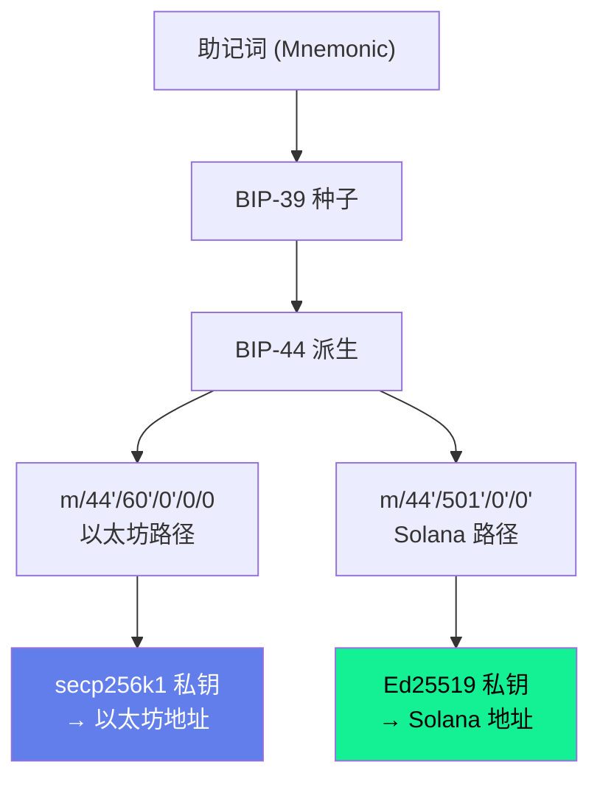
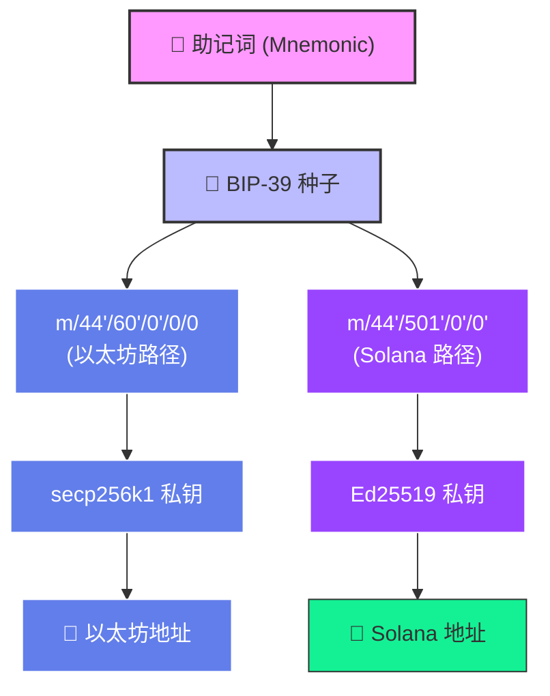

# Solana 账户与密钥体系分析

## 一、Solana 密钥格式说明

### 1.1 私钥格式

Solana 使用 **Ed25519** 椭圆曲线算法，私钥格式为：

```
完整私钥 = ed25519_seed(32字节) + ed25519_public_key(32字节) = 64字节
```

| 组成部分 | 长度 | 说明 |
|---|---|---|
| ed25519 seed | 32 字节 | 随机生成的种子，也是实际用于签名的私钥标量 |
| ed25519 公钥 | 32 字节 | 由 seed 派生的公钥，拼接在 seed 之后 |
| **完整私钥** | **64 字节** | Solana 标准私钥格式 |

**base58 编码后的长度**：
- 仅 32 字节 seed 的 base58：约 44 字符
- 完整 64 字节私钥的 base58：约 88 字符

> ⚠️ 如果你的私钥 base58 长度只有 44 字符左右，说明只有 seed 部分，缺少公钥拼接。需用 `ed25519.NewKeyFromSeed(seed)` 补全为 64 字节。

### 1.2 公钥与地址的关系

**在 Solana 中，地址（address）就是公钥（public key）的 base58 编码，两者是同一个东西。**

```
Solana 地址 = base58(Ed25519 公钥的 32 字节)
```

与以太坊的差异对比：

| 链 | 公钥 → 地址的转换 |
|---|---|
| **以太坊** | `address = keccak256(publicKey)[12:32]`，需要额外哈希 + 取后 20 字节 |
| **Solana** | `address = base58(publicKey)`，**无需额外哈希或转换** |

因此，在代码中 `privateKey.PublicKey().String()` 得到的就是正确的 Solana 地址。

### 1.3 从地址反推公钥

因为 Solana 地址就是公钥的 base58 编码，所以可以直接反向解码：

```
地址 (base58) → 解码 → 公钥原始字节 (32字节 hex)
```

示例：

| 格式 | 值 |
|---|---|
| Solana 地址 (base58) | `AqcVUtdrgqcCU87bsjaLkkhd3Ho94hVUep8Kh3tDGWeF` |
| 公钥 hex | `922d30e75c83b06cff8f27e15cdf55a62f3a7f9093956b247931c6ab2c8925fc` |
| 公钥字节长度 | 32 bytes |

---

## 二、MetaMask 私钥与 Solana 地址的关系

### 2.1 问题描述

从 MetaMask 导出的私钥（hex 格式，32 字节）无法直接派生出 MetaMask 钱包中显示的 Solana 地址。

**具体案例**：

| 项目 | 值 |
|---|---|
| MetaMask 导出的私钥 (hex) | `b95fbefacd5be9906850b569f281a26217329f405fba5ad1a33e3ce261d64943` |
| 该私钥作为 secp256k1 → 以太坊地址 | `0x7541EB24754e0037b0A8561948dB748F809238F3` ✅ |
| 该私钥作为 Ed25519 seed → Solana 地址 | `DTc63CZpAPXGB9BSvyp4t6EDBTX7uDiBxJvBzWWnT5Ua` ❌ 不匹配 |
| MetaMask 显示的 Solana 地址 | `AqcVUtdrgqcCU87bsjaLkkhd3Ho94hVUep8Kh3tDGWeF` 🎯 目标 |

### 2.2 根本原因

**MetaMask 导出的私钥是 secp256k1 算法的（以太坊曲线），而 Solana 使用 Ed25519 算法（不同的椭圆曲线）。同一个私钥数值在两条曲线上会生成完全不同的公钥。**



即同一个 32 字节数值：
- 在 secp256k1 曲线上 → 以太坊公钥 → 以太坊地址
- 在 Ed25519 曲线上 → 不同的公钥 → 不同的 Solana 地址
- 但都不是 MetaMask 显示的 Solana 地址！

### 2.3 MetaMask 生成 Solana 地址的实际流程

MetaMask 使用 **同一个助记词**，通过 **不同的 BIP-44 派生路径**，为不同链生成各自的密钥对：



| 链 | BIP-44 派生路径 | 椭圆曲线 | 私钥算法 |
|---|---|---|---|
| 以太坊 | `m/44'/60'/0'/0/0` | secp256k1 | ECDSA |
| Solana | `m/44'/501'/0'/0'` | Ed25519 | EdDSA (SLIP-0010) |

**关键点**：以太坊私钥和 Solana 私钥是从同一个助记词派生出的**完全不同的值**，无法互相推导。

### 2.4 结论与解决方案

| 操作 | 可行性 |
|---|---|
| 助记词 → 以太坊私钥 | ✅ |
| 助记词 → Solana 私钥 | ✅ |
| 以太坊私钥 → Solana 私钥 | ❌ 不可行 |
| 以太坊私钥 → Solana 地址 | ❌ 不可行 |
| 公钥 → 私钥 / seed | ❌ 数学上不可行（ECDLP 问题） |

**要获取 MetaMask 中 Solana 地址对应的私钥，必须**：
1. 在 MetaMask 中导出**助记词**（不是私钥）
2. 使用助记词 + Solana 派生路径 `m/44'/501'/0'/0'` 派生 Ed25519 密钥对
3. 派生出的才是 MetaMask 显示的 Solana 地址对应的真正私钥

### 2.5 代码示例：从助记词派生 Solana 密钥

```go
import (
    "github.com/btcsuite/btcd/btcutil/hdkeychain"
    "github.com/btcsuite/btcd/chaincfg"
    "github.com/gagliardetto/solana-go"
    "github.com/tyler-smith/go-bip39"
)

func DeriveSolanaKeyFromMnemonic(mnemonic string) (solana.PrivateKey, error) {
    // 1. 从助记词生成种子
    seed := bip39.NewSeed(mnemonic, "")

    // 2. 从种子生成主密钥
    masterKey, err := hdkeychain.NewMaster(seed, &chaincfg.MainNetParams)
    if err != nil {
        return nil, err
    }

    // 3. 按 BIP-44 路径派生: m/44'/501'/0'/0'
    // 注意: Solana 使用 SLIP-0010 规范，与标准 BIP-32 略有不同
    // 推荐使用 github.com/nickklman/solana-go 或专门的 Ed25519 BIP-32 库

    // 简单方式：使用已知的 Solana 派生库
    // ...
}
```

> 💡 实际项目中推荐使用专门的 Solana 助记词派生库，如 `github.com/mr-tron/base58` 配合 `github.com/tyler-smith/go-bip39` 和 SLIP-0010 Ed25519 BIP-32 实现。

---

## 三、Solana 交易 ID 与签名

### 3.1 交易 ID 的本质

**Solana 的交易 ID（Transaction Signature）就是交易签名的 base58 编码字符串**，两者是同一个东西的不同表示形式。

```
交易数据 → Ed25519 签名 → 64 字节签名数据 → base58 编码 → 交易 ID（约 87~88 字符）
```

| 项目 | 说明 |
|---|---|
| 交易 ID 格式 | 签名的 base58 编码字符串 |
| 签名长度 | 64 字节（Ed25519 签名） |
| base58 后长度 | 约 87~88 个字符 |
| 本质 | **交易 ID ≡ 交易签名 ≡ base58(Ed25519 签名)** |

### 3.2 与以太坊交易 ID 的对比

| 链 | 交易 ID 的生成方式 | 长度 |
|---|---|---|
| **Solana** | `txId = base58(Ed25519 签名)` | ~88 字符 |
| **以太坊** | `txHash = keccak256(RLP 编码的交易数据)` | 64 hex 字符（0x 前缀后 66 字符） |

关键区别：
- Solana 交易 ID 是**签名本身**的 base58 编码
- 以太坊交易哈希是**交易数据**的哈希，签名只是交易数据的一部分

### 3.3 项目代码中的体现

本项目 [solanaclient.go](internal/sdk/solanaclient.go) 中的相关代码：

**发送交易，返回签名作为 txId**（第 276-281 行）：

```go
signature, err := c.rpcClient.SendTransaction(c.ctx, tx)
return signature.String(), nil  // signature.String() 即 base58 编码的交易签名
```

**用 txId 查询交易时，从 base58 解码为签名**（第 100 行）：

```go
signature, err := solana.SignatureFromBase58(txId)
```

**返回数据中 txId 字段名也为 signature**（第 123、169 行）：

```go
"signature": txId
```

### 3.4 交易签名在 Solana 中的用途

| 用途 | RPC 方法 | 说明 |
|---|---|---|
| 查询交易状态 | `GetSignatureStatuses` | 通过签名查询交易确认状态 |
| 查询交易详情 | `GetTransaction` | 通过签名获取完整交易数据 |
| 确认交易成功 | `ConfirmTransaction` | 等待签名对应的交易达到指定确认级别 |
| 请求空投回调 | `RequestAirdrop` | 返回值就是空投交易的签名 |

---

## 四、Solana 测试网配置总结

### 4.1 可用的 Devnet 节点

经过搜索和测试，以下是目前可用的 Solana Devnet 公共 RPC 节点：

| 提供商 | RPC URL | WS URL | 可用性 | 备注 |
|---|---|---|---|---|
| **QuickNode (推荐)** | `https://docs-demo.solana-devnet.quiknode.pro/` | `wss://docs-demo.solana-devnet.quiknode.pro/` | ✅ 可用 | 免费演示节点，有限速 |
| Solana 官方 | `https://api.devnet.solana.com` | `wss://api.devnet.solana.com/` | ⚠️ 可能无法访问 | 国内网络通常无法直连 |

### 4.2 测试网水龙头（Faucet）

在 Devnet 上可以通过水龙头获取测试用的 SOL：

| 方式 | 说明 |
|---|---|
| RPC `RequestAirdrop` | 通过 RPC 调用直接请求空投，每次最多 2 SOL |
| CLI `solana airdrop` | 使用 Solana CLI 工具请求空投 |
| Web Faucet | 访问 https://faucet.solana.com 网页请求空投 |

**RequestAirdrop 代码示例**：

```go
ctx, cancel := context.WithTimeout(context.Background(), 60*time.Second)
defer cancel()

signature, err := client.rpcClient.RequestAirdrop(
    ctx,
    client.fromAddress,
    1_000_000_000, // 1 SOL = 1,000,000,000 lamports
    rpc.CommitmentConfirmed,
)
```

### 4.3 项目当前测试配置

项目测试中使用的 Solana Devnet 配置（定义在 `solanaclient_test.go` 的 `getTestSolanaConf()` 函数中）：

```go
config.SolanaConf{
    RpcUrl:          "https://docs-demo.solana-devnet.quiknode.pro/",
    WsUrl:           "wss://docs-demo.solana-devnet.quiknode.pro/",
    PrivateKey:      "5MaiiCavjCmn9Hs1o3eznqDEhRwxo7pXiAYez7keQUviUkauRiTMD8DrESdrNjN8zd9mTmVhRvBJeg5vhyvgrAhG",
    CommitmentLevel: "confirmed",
    SkipPreflight:   false,
    MaxRetries:      3,
}
```

### 4.4 Devnet 验证测试项

可通过以下测试验证 Devnet 连接是否正常：

| 测试项 | RPC 方法 | 预期结果 |
|---|---|---|
| 健康检查 | `GetHealth()` | 返回 `"ok"` |
| 最新区块哈希 | `GetLatestBlockhash()` | 返回有效的 Blockhash |
| 当前 Slot | `GetSlot()` | 返回大于 0 的值 |
| 节点版本 | `GetVersion()` | 返回版本信息字符串 |
| 创世哈希 | `GetGenesisHash()` | 返回创世区块哈希 |
| 账户余额 | `GetBalance()` | 返回 lamports 余额 |
| 请求空投 | `RequestAirdrop()` | 返回交易签名 |

### 4.5 Commitment 确认级别

Solana 支持 3 种确认级别：

| 级别 | 说明 | 适用场景 |
|---|---|---|
| `processed` | 节点已处理，但未确认 | 需要最快响应，对一致性要求低 |
| `confirmed` | 已被超级多数验证节点确认（推荐） | 一般交易和查询 |
| `finalized` | 已被超过 2/3 验证节点最终确认 | 对安全性要求极高的场景 |

项目中默认使用 `confirmed` 级别，无效值也会回退到 `confirmed`。

---

## 五、参考链接

- [Solana 官方文档 - Keypairs](https://docs.solana.com/developing/programming-model/accounts#keypairs)
- [Solana 官方文档 - Transaction Signature](https://docs.solana.com/developing/programming-model/transactions#signature)
- [BIP-44 多币种派生路径规范](https://github.com/bitcoin/bips/blob/master/bip-0044.mediawiki)
- [SLIP-0010 Ed25519 BIP-32 派生规范](https://github.com/satoshilabs/slips/blob/master/slip-0010.md)
- [Solana Faucet](https://faucet.solana.com)
- [QuickNode Solana RPC 文档](https://docs.quicknode.com/)
